# Jinja2 Tutorial - Part 1 - Introduction And Variable Substitution

This post is the first of the Jinja tutorial series where I'll provide
an overview of the language, discussion of its features and a healthy
dose of example use cases. If you're new to the world of templating,
know what templates are but never used Jinja before, or simply need
to refresh your memory, then you should found this series useful.

## Contents

- [Introduction](#intro)
  + [What is Jinja2?](#what-j2)
  + [Where is it used?](#where-j2)
  + [What is so good about it?](#features-j2)
  + [Why would I want to use it?](#why-j2)
  + [How does it work?](#how-j2)
- [Jinja templating basics](#basics)
  + [Variable substitution](#var-sub)
  + [Examples](#var-sub-ex)
  + [Python example](#var-sub-ex-python)
  + [Ansible example](#var-sub-ex-ansible)
  + [Dictionaries as variables](#var-sub-dict)
  + [Undefined variables](#undef-var)
- [Adding comments](#comments)
  + [Conclusion](#conclusion)
  + [References](#references)
  + [GitHub repository with resources for this post](https://github.com/progala/ttl255.com/tree/master/jinja2/jinja-tutorial-p1-intro-substitution)

## Introduction

## What Is Jinja2?

Jinja2 is a feature rich templating language widely used in the Python
ecosystem. It can be used directly in your Python programs and
a lot of larger applications use it as their template rendering engine.

Templating languages allow creation of text based documents where
some of the content can be dynamically generated. Resulting files
can be HTML, JSON, XML, or anything that uses pure text as the encoding.
The idea is to capture business logic in the code while giving
template designer tools to control flow and layout of the end document.

## Where Is It Used?

Some notable examples of applications using Jinja2 are Ansible, Django,
Flask, Salt and Trac. Many other Python web frameworks also use it
as well as countless other Python projects.

## What Is So Good About It?

Jinja2 comes with a lot of great features:

- Control structures (loops and conditional statements)
- Rich set of built-in filters and tests
- Template inheritance
- Macros
- Support for custom filters
- HTML escaping
- Sandbox environment for safely rendering untrusted templates
- Easy to debug
- Configurable syntax

Discussions and example use of the above features will form large
part of this series.

## Why Would I Want To Use It?

Web frameworks like Flask and Django, or automation ones like Ansible
and Salt, provide out of the box support for Jinja. It's
a natural choice for templating engine when using any of those.
Ansible even uses a lot of the Jinja syntax in its Playbooks.

For your own programs, you should consider using Jinja2 if you
have blocks of text that are dynamically generated from data structures.
Not only will it logically separate your templates from your code,
it will also allow others to make changes to the templates
independently without having to modify source code of the application.

I think that having good knowledge of Jinja2 will allow you to become more
productive. It's also ubiquitous in the world of network automation.
With Jinja's widespread use you will find that it's worth
investing your time into learning it.

## How Does It Work?

Jinja2 essentially needs two source ingredients, template and data
that will be used to render the final document.

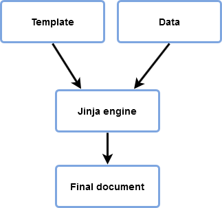

Jinja2 doesn't care where the data comes from, this could come from JSON
returned by some API, be loaded from static YAML file,
or simply be a Python Dict defined in our app.

All that matters is that we have Jinja template and some data
to render it with.

## Jinja Templating Basics

We now know what Jinja is and why would one use it. Time to start
looking at simple examples to familiarize ourselves with the general
look and structure of templates.

Basic idea behind templating is taking some text documents and figuring
out which bits are unchanged among all instances and which can be
parametrized. That is, we want some of the elements of the text
to change depending on the data we have available at hand.

Since I mostly work with network device configs, this is what
I'll be using in my examples.

## Variable Substitution

Below is a short Cisco IOS configuration snippet which
we'll use in our first example.

    hostname par-rtr-core-01

    no ip domain lookup
    ip domain name local.lab
    ip name-server 1.1.1.1
    ip name-server 8.8.8.8

    ntp server 0.pool.ntp.org prefer
    ntp server 1.pool.ntp.org

First step that we need to take is to identify elements that are static
and the ones that might change between devices.

In our case words like "hostname", "ip name-server" etc.
are configuration statements used by particular network OS.
These remain unchanged, as long as the same NOS is running on the device.

The actual hostname, and possibly names of the name servers
and ntp servers, should be turned into variables
that will be substituted for actual values when template is rendered.

Now, I said 'possibly' with regards to some of the elements
because these decisions are specific to your environment.
Generally, it's easier to parametrize these elements early on even if
currently the same values are used everywhere.
Over time our network might grow and some of the values might
depend on the region or data center location which lends
itself naturally to using variable reference.
Or perhaps you want to change one of the name-servers,
by parameterizing these values you only have to change them in one
place followed by re-generation of the configs for all of the devices.

For the sake of our example I decided to turn hostname, name-servers
and ntp servers into variables. Our end template can be found below:

    hostname {{ hostname }}

    no ip domain lookup
    ip domain name local.lab
    ip name-server {{ name_server_pri }}
    ip name-server {{ name_server_sec }}

    ntp server {{ ntp_server_pri }} prefer
    ntp server {{ ntp_server_sec }}

In Jinja anything found between double opening and double closing curly
braces tells the engine to evaluate and then print it.
Here the only thing found between curly braces is a name,
specifically a variable name. Jinja expects this variable
to be provided to the engine by you and it simply takes
the value referred by the variable replacing `{{ name }}`
statement with that value.

In other words, Jinja just substitutes the variable name for its value.
That is the most basic component you'll be using in your templates.

Ok, so one thing gets replaced by the other. But how do
we define the "thing" and how do we give it to Jinja engine?

This is where we need to choose a data format and tool that feeds
the data to our template.

There is quite a few options, with the below ones being
the most commonly used.

For data format:

- YAML file
- JSON file
- Native Python dictionary

For glue, some of the options:

- Python script
- Ansible playbook
- Built-in support in the Web framework (Flask, Django)

## Examples

For most of my examples I'll be using various Python scripts
and Ansible playbooks, with data coming from native
Python dict as well as YAML and JSON files.

Here I'll use minimal Python script followed by Ansible playbook.
Ansible example shows how easy it's to generate templates with little,
or no, programming skills. You'll also be seeing Ansible a lot
in the world of infrastructure automation so it's good to know how
to use it for generating files with templates.

Python Example

First off, Python script:

    from jinja2 import Template

    template = """hostname {{ hostname }}

    no ip domain lookup
    ip domain name local.lab
    ip name-server {{ name_server_pri }}
    ip name-server {{ name_server_sec }}

    ntp server {{ ntp_server_pri }} prefer
    ntp server {{ ntp_server_sec }}"""

    data = {
        "hostname": "core-sw-waw-01",
        "name_server_pri": "1.1.1.1",
        "name_server_sec": "8.8.8.8",
        "ntp_server_pri": "0.pool.ntp.org",
        "ntp_server_sec": "1.pool.ntp.org",
    }

    j2_template = Template(template)

    print(j2_template.render(data))

And the output:

    hostname core-sw-waw-01

    no ip domain lookup
    ip domain name local.lab
    ip name-server 1.1.1.1
    ip name-server 8.8.8.8

    ntp server 0.pool.ntp.org prefer
    ntp server 1.pool.ntp.org

It worked wonderfully. Template was rendered with
the data we provided to it.

As you can see this really is quite simple, template is just some text
with placeholders, data is a standard Python dictionary with
each key name corresponding to the variable name in the template.
We just need to create jinja2 Template object and pass our
data to its render method.

I should mention that the way we render Jinja in the above script
should only be used for debugging and proof of concept code.
In the real world data should come from external files or
databases and templates should be loaded after we set up Jinja environment.
I didn't want to muddy the waters early on as
we'll dig deeper into these concepts a bit later.

Ansible Example

Just to show alternatives, we will also render the same
template using Ansible. Here template is stored in a separate
file and data comes from the host var file matching the name of the device,
which is how we'd generally record per-host data.

Below is the directory structure:

    przemek@quasar:~/nauto/jinja/ansible$ ls -R
    .:
    hosts.yml host_vars out templates templ-simple-render.yml vars

    ./host_vars:
    core-sw-waw-01.yml

    ./out:

    ./templates:
    core-sw-waw-01.j2

    ./vars:

YAML file with data:

    (venv) przemek@quasar:~/nauto/jinja/ansible$ cat host_vars/core-sw-waw-01.yml
    ---
    hostname: core-sw-waw-01
    name_server_pri: 1.1.1.1
    name_server_sec: 8.8.8.8
    ntp_server_pri: 0.pool.ntp.org
    ntp_server_sec: 1.pool.ntp.org

Template is identical to the one used in Python example but it's stored
in an external file:

    (venv) przemek@quasar:~/nauto/jinja/ansible$ cat templates/base-cfg.j2
    hostname {{ hostname }}

    no ip domain lookup
    ip domain name local.lab
    ip name-server {{ name_server_pri }}
    ip name-server {{ name_server_sec }}

    ntp server {{ ntp_server_pri }} prefer
    ntp server {{ ntp_server_sec }}

And finally, playbook that does the rendering:

    (venv) przemek@quasar:~/nauto/jinja/ansible$ cat j2-simple-render.yml
    ---
    - hosts: core-sw-waw-01
    gather_facts: no
    connection: local

    tasks:
    - name: Render config for host
    template:
    src: "templates/base-cfg.j2"
    dest: "out/{{ inventory_hostname }}.cfg"

All that's left is to execute our Playbook:

    (venv) przemek@quasar:~/nauto/jinja/ansible$ ansible-playbook -i hosts.yml j2-simple-render.yml

    PLAY [core-sw-waw-01] *************************************************************************************************************

    TASK [Render config for host] *****************************************************************************************************
    changed: [core-sw-waw-01]

    PLAY RECAP ************************************************************************************************************************
    core-sw-waw-01 : ok=1 changed=1 unreachable=0 failed=0 skipped=0 rescued=0 ignored=0

The result matches the output of Python script, except here
we save the output to the file:

    (venv) przemek@quasar:~/nauto/jinja/ansible$ cat out/core-sw-waw-01.cfg
    hostname core-sw-waw-01

    no ip domain lookup
    ip domain name local.lab
    ip name-server 1.1.1.1
    ip name-server 8.8.8.8

    ntp server 0.pool.ntp.org prefer
    ntp server 1.pool.ntp.org

These examples are perhaps not overly exciting but with variable
substitution alone we can create some useful templates.
You can also see how little effort was required
to get started with rendering templates in Ansible.

## Dictionaries As Variables

Let's continue with variable substitution but
we'll use more complex data structure.
This time we'll use variables that are dictionaries.

Using dictionaries (also called hash tables or objects) allows
for logical grouping of related pieces of data.
For instance, attributes related to an interface can be
stored in a dictionary, here shown in JSON format:

    {
        "interface": {
            "name": "GigabitEthernet1/1",
            "ip_address": "10.0.0.1/31",
            "description": "Uplink to core",
            "speed": "1000",
            "duplex": "full",
            "mtu": "9124"
        }
    }

Accessing items in dictionary is very convenient, you just need
to know the key to get corresponding value,
and hence are ubiquitous in the world of JSON and YAML.

Jinja gives a handy way of accessing dictionary keys using
using "dot" notation. However this only works for
keys that don't have special characters in the name.

Using above interface dictionary we could
create interface config snippet using below template:

    interface {{ interface.name }}
    description {{ interface.description }}
    ip address {{ interface.ip_address }}
    speed {{ interface.speed }}
    duplex {{ interface.duplex }}
    mtu {{ interface.mtu }}

And this is what we get once it's rendered:

    interface GigabitEthernet1/1
    description Uplink to core
    ip address 10.0.0.1/31
    speed 1000
    duplex full
    mtu 9124

So that was pretty straightforward but already opens up more
possibilities over using simple variables,
especially for objects having multiple attributes.

Now, remember that I mentioned that "dot" notation can't be used with
keys having special characters in their names. If you have `.` - dot,
`-` - dash, or anything else that is not allowed as a character
in the Python variable name then you can't use dot notation.
In these cases you need to use standard Python subscript notation `[]`.
I find this mostly is a problem with keys that are IP addresses.

For instance to access the `10.0.0.0/24` key in the below
dictionary we have to use Python subscripts:

    prefixes:
    10.0.0.0/24:
    description: Corporate NAS
    region: Europe
    site: Telehouse-West

Template using the `10.0.0.0/24` key:

    Details for 10.0.0.0/24 prefix:
    Description: {{ prefixes['10.0.0.0/24'].description }}
    Region: {{ prefixes['10.0.0.0/24'].region }}
    Site: {{ prefixes['10.0.0.0/24'].site }}

## Undefined Variables

I feel like this is a good place to talk about what happens
when Jinja encounters an undefined variable. This is actually relatively
common when dealing with larger templates that use a lot of variables.

By default, when encountering an evaluation statement with undefined
variable Jinja will replace it with an empty string.
This often comes as a surprise to people writing their first templates.

This behavior can be changed by setting argument `undefined`,
taken by Template and Environment objects, to a different Jinja
undefined type. Default type is `Undefined`,
but there are other types available, `StrictUndefined` being the most
useful one. By using `StrictUndefined` type we tell Jinja
to raise error whenever there's an attempt at using undefined variable.

Compare the results of rendering the below template with provided data,
first one using default `Undefined` type and
second one using `StrictUndefined`:

    from jinja2 import Template

    template = "Device {{ name }} is a {{ type }} located in the {{ site }} datacenter."

    data = {
        "name": "waw-rtr-core-01",
        "site": "warsaw-01",
    }

    j2_template = Template(template)

    print(j2_template.render(data))

    Device waw-rtr-core-01 is a located in the warsaw-01 datacenter.

Our template made reference to variable named `type` but data we provided
does not have that var so the final evaluation results in an empty string.

Second run will use `StrictUndefined` type:

    from jinja2 import Template, StrictUndefined

    template = "Device {{ name }} is a {{ type }} located in the {{ site }} datacenter."

    data = {
        "name": "waw-rtr-core-01",
        "site": "warsaw-01",
    }

    j2_template = Template(template, undefined=StrictUndefined)

    (venv) przemek@quasar:~/nauto/jinja/python$ python j2_undef_var_strict.py
    Traceback (most recent call last):
    File "j2_undef_var_strict.py", line 12, in <module>
    print(j2_template.render(data))
    File "/home/przemek/nauto/jinja/python/venv/lib/python3.6/site-packages/jinja2/environment.py", line 1090, in render
    self.environment.handle_exception()
    File "/home/przemek/nauto/jinja/python/venv/lib/python3.6/site-packages/jinja2/environment.py", line 832, in handle_exception
    reraise(*rewrite_traceback_stack(source=source))
    File "/home/przemek/nauto/jinja/python/venv/lib/python3.6/site-packages/jinja2/_compat.py", line 28, in reraise
    raise value.with_traceback(tb)
    File "<template>", line 1, in top-level template code
    jinja2.exceptions.UndefinedError: 'type' is undefined

With strict error checking we get error straight away.

It's worth noting that Ansible uses `StrictUndefined` by default
so when you us it to render Jinja template you'll get errors
whenever there's a reference to an undefined variable.

Overall I suggest always enabling undefined type to `StrictUndefined`.
If you don't do it you can get some very subtle bugs in your templates
that will be difficult to find. At first it might be easy to understand
why a value is missing in the output but over time,
with templates growing larger, it's difficult for human eye to notice
something is not right. You definitely don't want to be only realizing
your templates are broken when loading config onto your devices!

## Adding Comments

Before we wrap this post up I just wanted to show you how to include
comments in your templates. Generally templates should be self
explanatory but comments come in handy when multiple people work on the
same template and your future self will probably be grateful
for explaining non-obvious bits as well. You can also use comment
syntax to disable parts of the template during debugging.

Comments are added using `{# ... #}` syntax. That is anything between
`{#` and `#}` is treated as a comment and will be ignored by the engine.

Below is our first example with some comments added to it:

    from jinja2 import Template

    template = """hostname {{ hostname }}

    {# DNS configuration -#}
    no ip domain lookup
    ip domain name local.lab
    ip name-server {{ name_server_pri }}
    ip name-server {{ name_server_sec }}

    {# Time servers config, we should use pool.ntp.org -#}
    ntp server {{ ntp_server_pri }} prefer
    ntp server {{ ntp_server_sec }}
    ntp server {{ ntp_server_trd }}"""

    data = {
        "hostname": "core-sw-waw-01",
        "name_server_pri": "1.1.1.1",
        "name_server_sec": "8.8.8.8",
        "ntp_server_pri": "0.pool.ntp.org",
        "ntp_server_sec": "1.pool.ntp.org",
    }

    j2_template = Template(template)

    print(j2_template.render(data))

And the output:

    hostname core-sw-waw-01

    no ip domain lookup
    ip domain name local.lab
    ip name-server 1.1.1.1
    ip name-server 8.8.8.8

    ntp server 0.pool.ntp.org prefer
    ntp server 1.pool.ntp.org
    ntp server

No sign of comments. Though you might have noticed `-` (dash) character
just before closing `#}`. Without that dash an extra empty line would
have been added after each comment.

Whitespace treatment in Jinja is not very intuitive and it's possibly
one of the most confusing parts of the language.
In one of the future posts I will discuss in detail different
scenarios and techniques that will allow you to make
your templates look exactly the way you want it.

## Conclusion

This concludes first post in the Jinja Tutorial series.
What I showed you here should be enough to get you to start creating
your own templates. In the future posts we'll have a look at
other features and we'll work through examples illustrating use cases.

# Jinja2 Tutorial - Part 2 - Loops And Conditionals

Welcome to part 2 of my Jinja2 Tutorial. In part 1 we learned
what Jinja2 is, what are its uses, and we started looking
at templating basics. Coming up next are loops and conditionals,
sprinkled with tests and a healthy dose of examples!

## Contents

- [Control structures](#ctrl-struct)
  + [Loops](#loops)
  + [Looping over dictionaries](#loop-dict)
- [Conditionals and tests](#cond-tests)
  + [Comparisons](#compare)
  + [Logical operators](#logic)
  + [Truthiness](#truth)
  + [Tests](#tests)
  + [Loop filtering](#loop-filter)
  + [`in` Operator](#in-op)
- [References](#references)
- [GitHub repository with resources for this post](https://github.com/progala/ttl255.com/tree/master/jinja2/jinja-tutorial-p2-loops-conditionals)

## Control Structures

In Jinja2 loops and conditionals come under name of control structures,
since they affect flow of a program.
Control structures use blocks enclosed by `` characters.

## Loops

First of the structures we'll look at is loops.

Jinja2 being a templating language has no need for wide choice of
loop types so we only get `for` loop.

For loops start with `` and
end with ``. This is very similar to
how you'd loop over an iterable in Python.

Here `my_item` is a loop variable that will be taking values as
we go over the elements. And `my_collection` is the name of 
the variable holding reference to the iterated collection.

Inside of the body of the loop we can use variable `my_item` in
other control structures, like `if` conditional,
or simply display it using `{{ my_item }}` statement.

Ok, but where would you use loops you ask? Using individual variables
in your templates works fine for the most part but you might find that
introducing hierarchy, and loops, will help with abstracting your data model.

For instance, prefix lists or ACLs are composed of a number of lines.
It wouldn't make sense to have these lines represented as individual variables.

Initially you could model a specific prefix list using one variable
per line, like so:

    PL_AS_65003_IN_line1: "permit 10.96.0.0/24"
    PL_AS_65003_IN_line2: "permit 10.97.11.0/24"
    PL_AS_65003_IN_line3: "permit 10.99.15.0/24"
    PL_AS_65003_IN_line4: "permit 10.100.5.0/25"
    PL_AS_65003_IN_line5: "permit 10.100.6.128/25"

Which could be used in the following template:

    # Configuring Prefix List
    ip prefix-list PL_AS_65003_IN
    {{ PL_AS_65003_IN_line1 }}
    {{ PL_AS_65003_IN_line2 }}
    {{ PL_AS_65003_IN_line3 }}
    {{ PL_AS_65003_IN_line4 }}
    {{ PL_AS_65003_IN_line5 }}

Rendering results:

    # Configuring Prefix List
    ip prefix-list PL_AS_65003_IN
    permit 10.96.0.0/24
    permit 10.97.11.0/24
    permit 10.99.15.0/24
    permit 10.100.5.0/25
    permit 10.100.6.128/25

This approach, while it works, has a few problems.

If we wanted to have more lines in our prefix list we'd have
to create another variable, and then another one, and so on.
We not only have to add these new items to our data structure,
templates would also have to have all of these
new variables included individually. This is not maintainable,
consumes a lot of time and is very error prone.

There is a better way, consider the below data structure:

    PL_AS_65003_IN:
    - permit 10.96.0.0/24
    - permit 10.97.11.0/24
    - permit 10.99.15.0/24
    - permit 10.100.5.0/25
    - permit 10.100.6.128/25

And the template rendering prefix list configuration:

    # Configuring Prefix List
    ip prefix-list PL_AS_65003_IN
    
        {{ line -}}
    

After rendering:

    # Configuring Prefix List
    ip prefix-list PL_AS_65003_IN
    permit 10.96.0.0/24
    permit 10.97.11.0/24
    permit 10.99.15.0/24
    permit 10.100.5.0/25
    permit 10.100.6.128/25

If you look closely you'll notice this is essentially modeling
the same thing, a prefix list with a number of entries.
But by using list we clearly state our intent.
Even visually you can tell straight away that all
of the indented lines belong to the PL_AS_65003_IN.

Adding to the prefix list here is simple, we just need to append
a new line to the block. Also, our templates don't have to change at all.
If we used loop to iterate, like we did here, over this list then
the new lines will be picked up if we re-run the rendering.
Small change but makes things a lot easier.

You might have noticed that there's still room for improvement here.
Name of the prefix list is hardcoded in the prefix list definition
and in our `for` loop. Fear not, that's something
we'll be improving upon shortly.

## Looping Over Dictionaries

Let's now see how we can loop over dictionaries. We will again
use `for` loop construct, remember, that's all we've got!

We can use the same syntax we used for iterating over elements of
the list but here we'll iterate over dictionary keys.
To retrieve value assigned to the key 
we need to use subscript, i.e. `[]`, notation.

One advantage of using dictionaries over lists is that we can use names
of elements as a reference, this makes retrieving
objects and their values much easier.

Say we used list to represent our collection of interfaces:

    interfaces:
    - Ethernet1:
    description: leaf01-eth51
    ipv4_address: 10.50.0.0/31
    - Ethernet2:
    description: leaf02-eth51
    ipv4_address: 10.50.0.2/31

There is no easy way of retrieving just `Ethernet2` entry.
We would either have to iterate over all elements and
do key name comparison or we'd have to resort to advanced filters.

One thing to note, and this is hopefully becoming apparent,
is that we need to spend some time modeling our data
so that it's easy to work with. This is something you will rarely get
right on your first attempt so don't be afraid to experiment and iterate.

Following with our example, we can keep data on individual interfaces
assigned to keys in `interfaces` dictionary,
instead of having them in a list:

    interfaces:
    Ethernet1:
    description: leaf01-eth51
    ipv4_address: 10.50.0.0/31
    Ethernet2:
    description: leaf02-eth51
    ipv4_address: 10.50.0.2/31

Now we can access this data in our template like so:

    
        interface {{ intf }}
        description {{ interfaces[intf].description }}
        ip address {{ interfaces[intf].ipv4_address }}
    

Giving us end result:

    interface Ethernet1
    description leaf01-eth51
    ip address 10.50.0.0/31
    interface Ethernet2
    description leaf02-eth51
    ip address 10.50.0.2/31

Here `intf` refers to `Ethernet1` and `Ethernet2` keys. To access
attributes of each interface we need to use `interfaces[intf]` notation.

There is another way of iterating over dictionary, which I personally
prefer. We can retrieve key and its value
at the same time by using `items()` method.

    
        interface {{ iname }}
        description {{ idata.description }}
        ip address {{ idata.ipv4_address }}
    

The end result is the same but by using `items()` method we simplify
access to the attributes. This becomes especially important
if you want to recursively iterate over deeply nested dictionaries.

I also promised to show how prefix list example can be improved upon,
and that's where `items()` comes in.

We make small modification to our data structure by making
each prefix list name a key int the dictionary `prefix_lists`

    prefix_lists:
    PL_AS_65003_IN:
    - permit 10.96.0.0/24
    - permit 10.97.11.0/24
    - permit 10.99.15.0/24
    - permit 10.100.5.0/25
    - permit 10.100.6.128/25

We now add outer loop iterating over key, value pairs in dictionary:

    # Configuring Prefix List
    
        ip prefix-list {{ pl_name }}
        
        {{ line -}}
        
    

Rendering gives us the same result:

    # Configuring Prefix List
    ip prefix-list PL_AS_65003_IN
    permit 10.96.0.0/24
    permit 10.97.11.0/24
    permit 10.99.15.0/24
    permit 10.100.5.0/25
    permit 10.100.6.128/25

And here you go, no more hardcoded references to the prefix list names!
If you need another prefix list you just need to add it
to the `prefix_lists` dictionary and
it will be picked up automatically by our `for` loop.

_Note:_ If you're using version of Python < 3.6 then dictionaries
are not ordered. That means order in which you recorded
your data might differ from the order in which
items will be processed inside of a template.

If you rely on the order in which they've been recorded you should
either use `collections.OrderedDict` if using Jinja2 in Python script,
or you can apply `dictsort` filter in your template
to order your dictionary by key or value.

To sort by key:

    

To sort by value:

    

This concludes basics of looping in Jinja2 templates.
The above use cases should cover 95% of your needs.

If you're looking for discussion of some advanced features
connected to looping, rest assured I will be doing write up
on those as well. I decided to leave more in depth Jinja2 topics
for the final chapters of this tutorial and focus
on the core stuff that lets you become productive quicker.

## Conditionals And Tests

Now that we're done with loops it's time to move on to conditionals.

Jinja2 implements one type of conditional statement,
the `if` statement. For branching out we can use `elif` and `else`.

Conditionals in Jinja2 can be used in a few different ways.
We'll now have a look at some use cases and how they
combine with other language features.

## Comparisons

First thing we look at is comparing values with conditionals,
these make use of `==, !=, >, >=, <, <=` operators.
These are pretty standard but I will show some examples nonetheless.

One common scenario where comparison is used is varying command
syntax based on the version, or vendor, of the installed OS.
For instance some time ago Arista had to change a number of commands
due to the lawsuit and we could use a simple
if statement to make sure our templates work with all of the EOS versions:

Template, vars, and rendered template for host using EOS 4.19:

    (venv) przemek@quasar:~/nauto/jinja/python$ python j2_render.py \
    -t templates/eos-ver.j2 -f vars/eos-ver-419.yml -d yaml
    ###############################################################################
    # Loaded template: templates/eos-ver.j2
    ###############################################################################

    hostname {{ hostname }}
    
        Detected EOS ver {{ eos_ver }}, using new command syntax.
    
        Detected EOS ver {{ eos_ver }}, using old command syntax.
    

    ###############################################################################
    # Render variables
    ###############################################################################

    eos_ver: 4.19
    hostname: arista_old_eos

    ###############################################################################
    # Rendered template
    ###############################################################################

    hostname arista_old_eos
    Detected EOS ver 4.19, using old command syntax.

And same for device running EOS 4.22:

    (venv) przemek@quasar:~/nauto/jinja/python$ python j2_render.py \
    -t templates/eos-ver.j2 -f vars/eos-ver-422.yml -d yaml
    ###############################################################################
    # Loaded template: templates/eos-ver.j2
    ###############################################################################

    hostname {{ hostname }}
    
        Detected EOS ver {{ eos_ver }}, using new command syntax.
    
        Detected EOS ver {{ eos_ver }}, using old command syntax.
    

    ###############################################################################
    # Render variables
    ###############################################################################

    eos_ver: 4.22
    hostname: arista_new_eos

    ###############################################################################
    # Rendered template
    ###############################################################################

    hostname arista_new_eos
    Detected EOS ver 4.22, using new command syntax.

Quite simple really yet very useful. All we did is check if recorded
EOS version is less than, or greater/equal than 4.22,
and this is enough to make sure correct syntax makes it to the configs.

To show more complex branching with comparisons I've got here na example
of template supporting multiple routing protocols
where only relevant config is generated for each device.

First we define some data for hosts.

Device running BGP:

    hostname: router-w-bgp
    routing_protocol: bgp

    interfaces:
    Loopback0:
    ip: 10.0.0.1
    mask: 32

    bgp:
    as: 65001

Device running OSPF:

    hostname: router-w-ospf
    routing_protocol: ospf

    interfaces:
    Loopback0:
    ip: 10.0.0.2
    mask: 32

    ospf:
    pid: 1

Device with default route only:

    hostname: router-w-defgw

    interfaces:
    Ethernet1:
    ip: 10.10.0.10
    mask: 24

    default_nh: 10.10.0.1

Then we create a template using conditionals with branching.
Additional protocols choices can be easily added as needed.

    hostname {{ hostname }}
    ip routing

    
        interface {{ intf }}
        ip address {{ idata.ip }}/{{ idata.mask }}
    

    
        router bgp {{ bgp.as }}
        router-id {{ interfaces.Loopback0.ip }}
        network {{ interfaces.Loopback0.ip }}/{{ interfaces.Loopback0.mask }}
    
        router ospf {{ ospf.pid }}
        router-id {{ interfaces.Loopback0.ip }}
        network {{ interfaces.Loopback0.ip }}/{{ interfaces.Loopback0.mask }} area 0
    
        ip route 0.0.0.0/0 {{ default_nh }}
    

Rendering results for all devices:

    hostname router-w-bgp
    ip routing

    interface Loopback0
    ip address 10.0.0.1/32

    router bgp 65001
    router-id 10.0.0.1
    network 10.0.0.1/32

    hostname router-w-ospf
    ip routing

    interface Loopback0
    ip address 10.0.0.2/32

    router ospf 1
    router-id 10.0.0.2
    network 10.0.0.2/32 area 0

    hostname router-w-defgw
    ip routing

    interface Ethernet1
    ip address 10.10.0.10/24

    ip route 0.0.0.0/0 10.10.0.1

So there you have it, one template supporting 3 different
configuration options, pretty cool.

## Logical Operators

No implementation of conditionals would be complete without logical
operators. Jinja2 provides these in the form of `and`, `or` and `not`.

There is not an awful lot to talk about here so here's
just a short example showing all of these in action:

    (venv) przemek@quasar:~/nauto/jinja/python$ python j2_render.py \
    -t templates/if-logic-ops.j2 -f vars/if-logic-ops.yml
    ###############################################################################
    # Loaded template: templates/if-logic-ops.j2
    ###############################################################################

    
        Both x and y are True. x: {{ x }}, y: {{ y }}
    

    
        At least one of x and z is True. x: {{ x }}, z: {{ z }}
    

    
        We see that z is not True. z: {{ z }}
    

    ###############################################################################
    # Render variables
    ###############################################################################

    x: true
    y: true
    z: false

    ###############################################################################
    # Rendered template
    ###############################################################################

    Both x and y are True. x: True, y: True

    At least one of x and z is True. x: True, z: False

    We see that z is not True. z: False

## Truthiness

This is is a good place to look at different variable types and their
truthiness. As is the case in Python, strings, lists, dictionaries, etc.,
variables evaluate to True if they're not empty.
For empty values evaluation results in False.

I created an example illustrating thruthiness of, non-empty
and empty, string, list and dictionary:

    (venv) przemek@quasar:~/nauto/jinja/python$ python j2_render.py \
    -t templates/if-types-truth.j2 -f vars/if-types-truth.yml
    ###############################################################################
    # Loaded template: templates/if-types-truth.j2
    ###############################################################################

    
        
            True
        
            False
        
    

    My one element list has bool value of: {{ bool_eval(my_list) }}
    My one key dict has bool value of: {{ bool_eval(my_dict) }}
    My short string has bool value of: {{ bool_eval(my_string) }}

    My empty list has bool value of: {{ bool_eval(my_list_empty) }}
    My empty dict has bool value of: {{ bool_eval(my_dict_empty) }}
    My empty string has bool value of: {{ bool_eval(my_string_empty) }}

    ###############################################################################
    # Render variables
    ###############################################################################

    {
        "my_list": [
            "list-element"
        ],
        "my_dict": {
            "my_key": "my_value"
        },
        "my_string": "example string",
        "my_list_empty": [],
        "my_dict_empty": {},
        "my_string_empty": ""
    }

    ###############################################################################
    # Rendered template
    ###############################################################################

    My one element list has bool value of: True
    My one key dict has bool value of: True
    My short string has bool value of: True

    My empty list has bool value of: False
    My empty dict has bool value of: False
    My empty string has bool value of: False

Personally I would advise against testing non-boolean types for truthiness.
There aren't that many cases where this could be useful and
it might make your intent non-obvious. If you simply want to check
if the variable exists then `is defined` test,
which we'll look at shortly, is usually a better choice.

## Tests

Tests in Jinja2 are used with variables and return True or False,
depending on whether the value passes the test or not.
To use this feature add `is` and test name after the variable.

The most useful test is `defined` which I already mentioned.
This test simply checks if given variable is defined, that is
if rendering engine can find it in the data it received.

Checking if variable is defined is something I use in most of my templates.
Remember that by default undefined variables will simply evaluate
to an empty string. By checking if variable is defined before its intended
use you make sure that your template fails during rendering.
Without this test you could end with incomplete document
and no indication that something is amiss.

Another family of tests that I find handy are used for checking type
of the variable. Certain operations require both operands
to be of the same type, if they're not Jinja2 will throw an error.
This applies to things like comparing numbers
or iterating over lists and dictionaries.

`boolean` - check is variable is a boolean
`integer` - check if variable is an integer
`float` - check if variable is a float
`number` - check if variable is number, will return True for
both integer and float
`string` - check if variable is a string
`mapping` - check if variable is a mapping, i.e. dictionary
`iterable` - check if variable can be iterated over,
will match string, list, dict, etc.
`sequence` - check if variable is a sequence

Below is an example of some variables having these tests applied:

    (venv) przemek@quasar:~/nauto/jinja/python$ python j2_render.py \
    -t templates/tests-type.j2 -f vars/tests-type.yml
    ###############################################################################
    # Loaded template: templates/tests-type.j2
    ###############################################################################

    {{ hostname }} is an iterable: {{ hostname is iterable }}
    {{ hostname }} is a sequence: {{ hostname is sequence }}
    {{ hostname }} is a string: {{ hostname is string }}

    {{ eos_ver }} is a number: {{ eos_ver is number }}
    {{ eos_ver }} is an integer: {{ eos_ver is integer }}
    {{ eos_ver }} is a float: {{ eos_ver is float }}

    {{ bgp_as }} is a number: {{ bgp_as is number }}
    {{ bgp_as }} is an integer: {{ bgp_as is integer }}
    {{ bgp_as }} is a float: {{ bgp_as is float }}

    {{ interfaces }} is an iterable: {{ interfaces is iterable }}
    {{ interfaces }} is a sequence: {{ interfaces is sequence }}
    {{ interfaces }} is a mapping: {{ interfaces is mapping }}

    {{ dns_servers }} is an iterable: {{ dns_servers is iterable }}
    {{ dns_servers }} is a sequence: {{ dns_servers is sequence }}
    {{ dns_servers }} is a mapping: {{ dns_servers is mapping }}

    ###############################################################################
    # Render variables
    ###############################################################################

    {
        "hostname": "sw-office-lon-01",
        "eos_ver": 4.22,
        "bgp_as": 65001,
        "interfaces": {
            "Ethernet1": "Uplink to core"
        },
        "dns_servers": [
            "1.1.1.1",
            "8.8.4.4",
            "8.8.8.8"
        ]
    }

    ###############################################################################
    # Rendered template
    ###############################################################################

    sw-office-lon-01 is an iterable: True
    sw-office-lon-01 is a sequence: True
    sw-office-lon-01 is a string: True

    4.22 is a number: True
    4.22 is an integer: False
    4.22 is a float: True

    65001 is a number: True
    65001 is an integer: True
    65001 is a float: False

    {'Ethernet1': 'Uplink to core'} is an iterable: True
    {'Ethernet1': 'Uplink to core'} is a sequence: True
    {'Ethernet1': 'Uplink to core'} is a mapping: True

    ['1.1.1.1', '8.8.4.4', '8.8.8.8'] is an iterable: True
    ['1.1.1.1', '8.8.4.4', '8.8.8.8'] is a sequence: True
    ['1.1.1.1', '8.8.4.4', '8.8.8.8'] is a mapping: False

You might've noticed that some of these tests might seem a bit ambiguous.
For instance to test if variable is a list it is not enough to check
if it's a sequence or an iterable. Strings also are both sequences
and iterables. So are the dictionaries, even though vanilla Python
classes them as Iterable and Mapping but not Sequence:

    >>> from collections.abc import Iterable, Sequence, Mapping
    >>>
    >>> interfaces = {"Ethernet1": "Uplink to core"}
    >>>
    >>> isinstance(interfaces, Iterable)
    True
    >>> isinstance(interfaces, Sequence)
    False
    >>> isinstance(interfaces, Mapping)
    True

So what all of this means? Well, I suggest the following tests
for each type of variable:

- Number, Float, Integer - these work just as expected,
so choose whatever fits your use case.
- Strings - it's enough to use `string` test: `{{ my_string is string }}`
- Dictionary - using `mapping` test is sufficient: `{{ my_dict is mapping }}`
- Lists - this is a tough one, full check should tests
if variable is a sequence but at the same time it cannot be a mapping
or a string: `{{ my_list is sequence and my list is not mapping and my list is not string }}`

In some cases we know dictionary, or a string, is unlikely to appear
so we can shorten the check by getting rid of `mapping` or `string`
test: `{{ my_list is sequence and my list is not string }}`
`{{ my_list is sequence and my list is not mapping }}`

For the full list of available tests follow the link in [References](#references).

## Loop Filtering

Last thing I wanted to touch on briefly are loop filtering and `in` operator.

Loop filtering does exactly what its name implies. It allows you to use
`if` statement with `for` loop to skip elements that you're not interested in.

We could for instance loop over dictionary containing interfaces and
process only the ones that have IP addresses:

    (venv) przemek@quasar:~/nauto/jinja/python$ python j2_render.py \
    -t templates/loop-filter.j2 -f vars/loop-filter.yml
    ###############################################################################
    # Loaded template: templates/loop-filter.j2
    ###############################################################################

    === Interfaces with assigned IPv4 addresses ===

    
        {{ intf }} - {{ idata.description }}: {{ idata.ipv4_address }}
    

    ###############################################################################
    # Render variables
    ###############################################################################

    {
        "interfaces": {
            "Loopback0": {
                "description": "Management plane traffic",
                "ipv4_address": "10.255.255.34/32"
            },
            "Management1": {
                "description": "Management interface",
                "ipv4_address": "10.10.0.5/24"
            },
            "Ethernet1": {
                "description": "Span port - SPAN1"
            },
            "Ethernet2": {
                "description": "PortChannel50 - port 1"
            },
            "Ethernet51": {
                "description": "leaf01-eth51",
                "ipv4_address": "10.50.0.0/31"
            },
            "Ethernet52": {
                "description": "leaf02-eth51",
                "ipv4_address": "10.50.0.2/31"
            }
        }
    }

    ###############################################################################
    # Rendered template
    ###############################################################################

    === Interfaces with assigned IPv4 addresses ===

    Loopback0 - Management plane traffic: 10.255.255.34/32
    Management1 - Management interface: 10.10.0.5/24
    Ethernet51 - leaf01-eth51: 10.50.0.0/31
    Ethernet52 - leaf02-eth51: 10.50.0.2/31

As you can see we have 6 interfaces in total but only 4 of them have
IP addresses assigned. With `is defined` test added to
the loop we filter out interfaces with no IP addresses.

Loop filtering can be especially powerful when iterating over
large payload returned from the device. In some cases you can ignore
most of the elements and focus on things that are of interest.

## In Operator

`in` operator which is placed between two values can be used to check
if value on the left is contained in the value on the right one.
You can use it to test if an element appears in the list or
if a key exists in a dictionary.

The obvious use cases for `in` operator is to check if something we're
interested in just exists in a collection,
we don't necessarily need to retrieve the item.

Looking at the previous example, we could check if Loopback0 is in
the list interfaces, and if it does, we will use it
to source Management Plane packets, if not we'll use Management1 interface.

Template:

    
        sflow source-interface Loopback0
        snmp-server source-interface Loopback0
        ip radius source-interface Loopback0
    
        sflow source-interface Management1
        snmp-server source-interface Management1
        ip radius source-interface Management1
    

Rendering results:

    sflow source-interface Loopback0
    snmp-server source-interface Loopback0
    ip radius source-interface Loopback0

Notice that even though `interfaces` is a dictionary containing
a lot of data we didn't iterate over it or retrieve any of the keys.
All we wanted to know was the presence of `Loopback0` key.

To be completely honest, the above template could use some tweaking,
we essentially duplicated 3 lines of config and hardcoded interface names.
That's not a very good practice, and I'll show you in
the next post how we can make improvements here.

And with that we've come to the end of part 2 of the Jinja2 tutorial.
Next I'll cover whitespaces, so you can make your documents look just right,
and we'll continue looking at the language features.
I hope you learned something useful here and do come back for more!

# Jinja2 Tutorial - Part 3 - Whitespace Control

Text documents are the final result of rendering templates.
Depending on the end consumer of these documents whitespace
placement could be significant. One of the major niggles in Jinja2,
in my opinion, is the way control statements and other elements affect
whitespace output in the end documents.

To put it bluntly, mastering whitespaces in Jinja2 is the only way
of making sure your templates generate text exactly the way you intended.

Now we know the importance of the problem, time to understand where
it originates, to do that we'll have a look at a lot of examples.
Then we'll learn how we can control rendering whitespaces in Jinja2 templates.

## Contents

- [Understanding whitespace rendering in Jinja2](#ws-in-j2)
- [Finding origin of whitespaces - alternative way](#or-alt)
  + [Origin of whitespaces - examples](#or-ex)
- [Controlling Jinja2 whitespaces](#ws-control)
  + [Trimming and stripping in action](#trim-strip)
  + [Manual control](#man-ctl)
  + [Indentation inside of Jinja2 blocks](#block-ind)
- [Whitespace control in Ansible](#ws-ansible)
  + [Example Playbooks](#ex-pb)
- [Closing thoughts](#thoughts)
- [References](#references)
- [GitHub repository with resources for this post](https://github.com/progala/ttl255.com/tree/master/jinja2/jinja-tutorial-p3-whitespace-control)

## Understanding Whitespace Rendering In Jinja2

We'll start our learning by looking at how Jinja2 renders whitespaces
by looking at trivial example, template with no variables,
just two lines of text and a comment:

    Starting line
    {# Just a comment #}
    Line after comment

This is how it looks like when it's rendered:

    Starting line

    Line after comment

Ok, what happened here? Did you expect an empty line to appear
in place of our comment? I did not. I'd expect the comment line to
just disappear into nothingness, but that's not the case here.

So here's a very important thing about Jinja2. All of the language blocks
are removed when the template is rendered but **all** of the whitespaces
remain in place. That is if there are spaces, tabs, or newlines,
before or after, blocks, then these will be rendered.

This explains why comment block left a blank line once template was
rendered. There is a newline character after the `{# #}` block.
While the block itself was removed, newline remained.

Below is a more involving, but fairly typical, template,
containing `for` loop and `if` statements:

    
        interface {{ iname }}
        description {{ idata.description }}
        
            ip address {{ idata.ipv4_address }}
        
    

Values that we feed into the template:

    interfaces:
    Ethernet1:
    description: capture-port
    Ethernet2:
    description: leaf01-eth51
    ipv4_address: 10.50.0.0/31

And this is how Jinja2 will render this, with all settings left to defaults:

    interface Ethernet1
    description capture-port

    interface Ethernet2
    description leaf01-eth51

    ip address 10.50.0.0/31

This doesn't look great, does it? There are extra newlines added
in few places. Also, interestingly enough, there are leading spaces
on some lines, that can't be seen on screen but could really break things
for us in the future. Overall it's difficult to figure out where
all of the whitespaces came from.

To help you in better visualizing generated text, here's the same output,
but now with all of the whitespaces rendered:

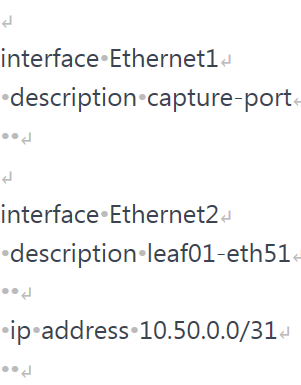

Each bullet point represents a space character, and return icon
represents newlines. You should now clearly see leading spaces that were
left by Jinja2 block on three of the lines, as well as all of the extra newlines.

Ok, that's all great you say, but it still is not so obvious where
these came from. The real question we want to answer is:

Which template line contributed to which line in the final result?

To answer that question I rendered whitespaces in the template as well
as the output text. Then I added colored, numbered, highlight blocks
in the lines of interest, to allow us to match source with the end product.

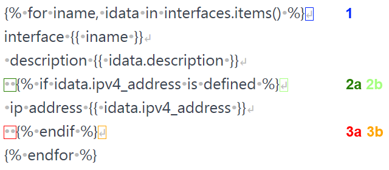

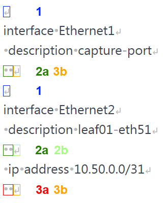

You should now see very easily where each of the Jinja blocks adds
whitespaces to the resulting text.

If you're also curious **why** then read on for detailed explanation:

1. Line containing `` block, number 1 with blue outlines,
ends with a newline. This block gets executed for each key in dictionary.
We have 2 keys, so we get extra 2 newlines inserted into final text.
2. Line containing `` block, numbers 2a and 2b with green and
light-green outlines, has 2 leading spaces and ends with a newline.
This is where things get interesting. The actual `` block
is removed leaving behind 2 spaces that always get rendered.
But trailing newline is inside of the block. This means that
with `` evaluating to `false` we get 2a but NOT 2b.
If it evaluates to `true` we get both 2a AND 2b.
3. Line containing `` block, numbers 3a and 3b with red and
orange outlines, has 2 leading spaces and ends with a newline.
This is again interesting and our situation here is the reverse of
previous case. Two leading spaces are inside of the `if` block,
but the newline is outside of it. So 3b, newline, is always rendered.
But when `` block evaluates to `true` we also get 3a,
if it's `false` then we get 3b only.

It's also worth pointing out that if your template continued
after `` block, that block would contribute one extra newline.
But worry not, we'll have some examples later on illustrating this case.

I hope you'll agree with me that the template we used in our example
wasn't especially big or complicated, yet it resulted in a fair
amount of additional whitespaces.

Luckily, and I couldn't stress enough how useful that is, there are ways
of changing Jinja2 behavior and taking back control
over exact look and feel of our text.

**Note**. The above explanation was updated on 12 Dec 2020.
Previously 1st occurence of 3b was incorrectly attributed to 2b.
Many thanks to Lawrr who triple-checked me and greatly helped
in getting to the bottom of this!

## Finding Origin Of Whitespaces - Alternative Way

We've talked a bit how to tame Jinja's engine with regards to
whitespace generation. You also know that tools like [**J2Live**](https://j2live.ttl255.com) can help you in
visualizing all the whitespaces in the produced text.
But can we tell with certainty which template line, containing block,
contributed these characters to the final render?

To get answer to that question we can use a little trick.
I came up with the following technique, that doesn't require any
external tools, for matching whitespaces coming from template
block lines with extraneous whitespaces appearing in the resulting text document.

This method is quite simple really, you just need to add unambiguous
characters to each of the block lines in the template that correspond
to lines in the rendered document.

I find it works especially well with template inheritance and macros,
topics we will discuss in the upcoming parts of this tutorial.

## Origin Of Whitespaces - Examples

Let's see that secret sauce in action then. We'll place additional
characters, carefully selected so that they stand out from surrounding
text, in strategic places on the lines with Jinja2 blocks.
I'm using the same template we already worked with so previously
that you can easily compare the results.

    (1)
        interface {{ iname }}
        description {{ idata.description }}
        (2)
        ip address {{ idata.ipv4_address }}
        (3)
    

Final result:

    (1) 
    interface Ethernet1
    description capture-port
    (2)
    (1)
    interface Ethernet2
    description leaf01-eth51
    (2)
    ip address 10.50.0.0/31
    (3)

I added `(1)`, `(2)` and `(3)` characters on the lines where we have
Jinja2 blocks. The end result matches what we got back from
J2Live with `Show whitespaces` option enabled.

If you don't have access to [**J2Live**](https://j2live.ttl255.com) or
you need to troubleshoot whitespace placement in production templates,
then I definitely recommend using this method. It's simple but effective.

Just to get more practice, I've added extra characters to slightly more
complex template. This one has branching `if` statement and some
text below final `endfor` to allow us 
to see what whitespaces come from that block.

Our template:

    (1)
        ip access-list extended {{ acl }}
        (2)
            (3)
                remark {{ line.text }}
                (4)
                permit {{ line.src }} {{ line.dst }}
            (5)
        (6)
    (7)

    # All ACLs have been generated

Data used to render it:

    access_lists:
    al-hq-in:
    - action: remark
    text: Allow traffic from hq to local office
    - action: permit
    src: 10.0.0.0/22
    dst: 10.100.0.0/24

End result:

    (1)
    ip access-list extended al-hq-in
    (2)
    (3)
    remark Allow traffic from hq to local office
    (4)
    (2)
    (3)
    permit 10.0.0.0/22 10.100.0.0/24
    (5)
    (6)
    (7)

    # All ACLs have been generated

A lot is happening here but there are no mysteries anymore.
You can easily match each source line with line in the final text.
And knowing where the whitespaces are coming from is the first step
to learning how to control them,
which is what we're going to talk about shortly.

Also, for comparison is the rendered text without using `helper` characters:

    ip access-list extended al-hq-in

    remark Allow traffic from hq to local office

    permit 10.0.0.0/22 10.100.0.0/24

    # All ACLs have been generated

If you're still reading this, congratulations! Your dedication
to mastering whitespace rendering is commendable.
Good news is that we're now getting to the bit where
we learn how to control Jinja2 behavior.

## Controlling Jinja2 Whitespaces

There are broadly three ways in which we can control
whitespace generation in our templates:

1. Enable one of, or both, `trim_blocks` and `lstrip_blocks`
rendering options.
2. Manually strip whitespaces by adding a minus sign `-`
to the start or end of the block.
3. Apply indentation inside of Jinja2 blocks.

First, I'll give you an easy, by far more preferable,
way of taming whitespace and then we'll dig into the more involving methods.

So here it comes:

Always render with `trim_blocks` and `lstrip_blocks` options enabled.

That's it, the big secret is out. Save yourself trouble and tell
Jinja2 to apply trimming and stripping to all of the blocks.

If you use Jinja2 as part of another framework then you might
have to consult documentation to see what the default behaviour
is and how it can be changed. Later in this post I will explain
how we can control whitespaces when using Ansible to render Jinja2 templates.

Just a few words of explanation on what these options do.
Trimming removes newline after block while stripping
removes all of spaces and tabs on the lines preceding the block.
Now, if you enable trimming alone, you might still get some funny
output if there are any leading whitespaces on the lines containing blocks,
so that's why I recommend having both of these enabled.

## Trimming And Stripping In Action

For example, this is what happens when we enable block trimming but
leave block stripping disabled:

    ip access-list extended al-hq-in
    remark Allow traffic from hq to local office
    permit 10.0.0.0/22 10.100.0.0/24

    # All ACLs have been generated

That's the same example we just had a look at, and I'm sure you didn't
expect this to happen at all.
Let's add some extra characters to figure out what happened:

    
    ip access-list extended {{ acl }}
    
    (3)
    remark {{ line.text }}
    (4)
    permit {{ line.src }} {{ line.dst }}
    
    
    

    # All ACLs have been generated

    ip access-list extended al-hq-in
    (3) remark Allow traffic from hq to local office
    (4) (3) permit 10.0.0.0/22 10.100.0.0/24

    # All ACLs have been generated

Another puzzle solved, we got rid of newlines with `trim_blocks` enabled
but leading spaces in front of `if` and `elif` blocks remained.
Something that is completely undesirable.

So how would this template render if we had both trimming and
stripping enabled? Have a look:

    ip access-list extended al-hq-in
    remark Allow traffic from hq to local office
    permit 10.0.0.0/22 10.100.0.0/24

    # All ACLs have been generated

Quite pretty right? This is what I meant when I talked about getting
**intended** result. No surprises, no extra newlines or spaces,
final text matches our expectations.

Now, I said enabling trim and lstrip options is an easy way,
but if for whatever reason you can't use it, or want to have total
control over how whitespaces are generated on
a per-block then we need to resort to manual control.

## Manual Control

Jinja2 allows us to manually control generation of whitespaces.
You do it by using a minus sing `-` to strip whitespaces from blocks,
comments or variable expressions. You need to add it to the start or
end of given expression to remove whitespaces
before or after the block, respectively.

As always, it's best to learn from examples. We'll go back to
example from the beginning of the post.
First we render without any `-` signs added:

    
        interface {{ iname }}
        description {{ idata.description }}
        
            ip address {{ idata.ipv4_address }}
        
    

Result:

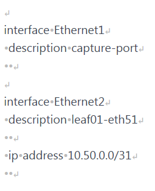

Right, some extra newlines and there are additional spaces as well.
Let's add minus sign at the end of `for` block:

    
        interface {{ iname }}
        description {{ idata.description }}
        
            ip address {{ idata.ipv4_address }}
        
    

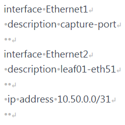

Looks promising, we removed two of the extra newlines.

Next we look at `if` block. We need to get rid of the newlines this
block generates so we try adding `-` at the end,
just like we did with `for` block.

    
        interface {{ iname }}
        description {{ idata.description }}
        
            ip address {{ idata.ipv4_address }}
        
    

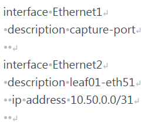

Newline after line with `description` under `Ethernet2` is gone.
Oh, but wait, why do we have two spaces in the line with `ip address` now?
Aha! These must've been the two spaces preceding the `if` block.
Let's just add `-` to the beginning of that block as well and we're done!

    
        interface {{ iname }}
        description {{ idata.description }}
        
            ip address {{ idata.ipv4_address }}
        
    

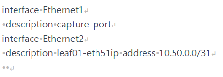

Hmm, now it's all broken! What happened here? A very good question indeed.

So here's the thing. These magical minus signs remove **all** of
the whitespaces before or after the block, not just whitespaces
on the same line. Not sure if you expected that,
I certainly did not when I first used manual whitespace control!

In our concrete case, the first `-` we added to the end
of `if` block stripped newline AND one space on the next line,
the one before **ip address***. Because, if we now look closely,
we should've had three spaces there not just two. One space that we
placed there ourselves and two spaces that we had in front of
the `if` block. But that space placed by us was removed
by Jinja2 due to `-` sign placed in the `if` block.

Not all is lost though. You might notice that just adding `-`
at the beginning of `if` and `endif` blocks will render text as intended.
Let's try doing that and see what happens.

    
        interface {{ iname }}
        description {{ idata.description }}
        
            ip address {{ idata.ipv4_address }}
        
    

Result:

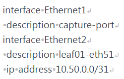

Bingo! We got rid of all those pesky whitespaces! But was this easy
and intuitive? Not really. And to be fair, this wasn't a very involving
example. Manually controlling whitespaces is certainly possible but
you must remember that all whitespaces are removed,
and just the ones on the same line as the block.

## Indentation Inside Of Jinja2 Blocks

There is a method of writing blocks that makes things a bit easier
and predictable. We simply put opening of the block at the beginning
of the line and apply indentation inside of the block. As always,
easier to explain using an example:

    
        ip access-list extended {{ acl }}
        
            
                remark {{ line.text }}
            
                permit {{ line.src }} {{ line.dst }}
            
        
    

    # All ACLs have been generated

As you can see we moved block opening `{%` all the way to the left and
then indented as appropriate inside of the block. Jinja2 doesn't care
about extra spaces inside of the `if` or `for` blocks, it will simply
ignore them. It only concerns itself with
whitespaces that it finds outside of blocks.

Let's render this to see what we get:

    ip access-list extended al-hq-in

    remark Allow traffic from hq to local office

    permit 10.0.0.0/22 10.100.0.0/24

    # All ACLs have been generated

How is this any better you may ask? At first sight, not much better at all.
But before I tell you why this might be a good idea, and where it is
especially useful I'll show you the same template as we had it previously.

We'll render it with `trim_blocks` enabled:

    
        ip access-list extended {{ acl }}
        
            
                remark {{ line.text }}
            
                permit {{ line.src }} {{ line.dst }}
            
        
    

    # All ACLs have been generated

    ip access-list extended al-hq-in
    remark Allow traffic from hq to local office
    permit 10.0.0.0/22 10.100.0.0/24

    # All ACLs have been generated

Terrible, just terrible. Indentation got completely out of whack.
But what am I trying to show you? Well, let's now render version of
this template with indentations inside of `for` and `if` blocks,
again with `trim_blocks` turned on:

    ip access-list extended al-hq-in
    remark Allow traffic from hq to local office
    permit 10.0.0.0/22 10.100.0.0/24

    # All ACLs have been generated

Isn't that nice? Remember that previously we had to enable
both `trim_blocks` and `lstrip_blocks` to achieve the same effect.

So here it is:

Starting Jinja2 blocks from the beginning of the line and applying
indentation inside of them is roughly equivalent to enabling `lstrip_block`.

I say _roughly_ equivalent because we don't strip anything here,
we just hide extra spaces inside of blocks preventing
them from being picked up at all.

And there is an extra bonus to using this method, it will make your
Jinja2 templates used in Ansible safer. Why? Read on!

## Whitespace Control In Ansible

As you probably already know Jinja2 templates are used quite heavily
when doing network automation with Ansible. Most people will use
Ansible's `template` module to do the rendering of templates.
That module by default enables `trim_blocks` option but `lstrip_blocks`
is turned off and needs to be enabled manually.

We can assume that most users will use the `template` module with
default options which means that using **indentation inside of the block**
technique will increase safety of our templates and the rendered text.

For the above reasons I'd recommend applying this technique
if you know your templates will be used in Ansible.
You will greatly reduce risk of your templates having seemingly
random whitespaces popping up in your configs and other documents.

I would also say that it's not a bad idea to always stick to this way
of writing your blocks if you haven't yet mastered the arcane ways
of Jinja2. There are no real downsides of writing your templates this way.

The only side effect here is how visually templates present themselves,
with a lot of blocks templates looking “busy”. This could make
it difficult to see lines of text between the blocks since these
need to have indentation matching your intent.

Personally I always try to use indentation within blocks method in
templates meant for Ansible. For other templates, when rendered with Python,
I do whatever feels right in terms of readability, and I render all
templates with block trimming and stripping enabled.

## Example Playbooks

For completeness sake, I built two short Ansible Playbooks, one uses
default setting for `template` module while the other enables `lstrip` option.

We'll be using the same template and data we used for testing `trim`
and `lstrip` options previously.

Playbook using default settings, i.e. only `trim` is turned on:

    ---
    - hosts: localhost
    gather_facts: no
    connection: local

    vars_files:
    - vars/access-lists.yml

    tasks:
    - name: Show vars
    debug:
    msg: "{{ access_lists }}"

    - name: Render config for host
    template:
    src: "templates/ws-access-lists.j2"
    dest: "out/ws-default.cfg"

And rendering results:

    ip access-list extended al-hq-in
    remark Allow traffic from hq to local office
    permit 10.0.0.0/22 10.100.0.0/24

    # All ACLs have been generated

If you recall, we got exactly same result when rendering this template
in Python with `trim` option enabled. Again, indentations are
misaligned so we need to do better.

Playbook enabling `lstrip`:

    ---
    - hosts: localhost
    gather_facts: no
    connection: local

    vars_files:
    - vars/access-lists.yml

    tasks:
    - name: Show vars
    debug:
    msg: "{{ access_lists }}"

    - name: Render config for host
    template:
    src: "templates/ws-access-lists.j2"
    dest: "out/ws-lstrip.txt"
    lstrip_blocks: yes

Rendered text:

    ip access-list extended al-hq-in
    remark Allow traffic from hq to local office
    permit 10.0.0.0/22 10.100.0.0/24

    # All ACLs have been generated

And again, same result as when you enabled `trim` and `lstrip`
when rendering Jinja2 in Python.

Finally, let's run the first Playbook, with default setting,
using the template with indentation inside of blocks.

Playbook:

    ---
    - hosts: localhost
    gather_facts: no
    connection: local

    vars_files:
    - vars/access-lists.yml

    tasks:
    - name: Show vars
    debug:
    msg: "{{ access_lists }}"

    - name: Render config for host
    template:
    src: "templates/ws-bi-access-lists.j2"
    dest: "out/ws-block-indent.txt"

Result:

    ip access-list extended al-hq-in
    remark Allow traffic from hq to local office
    permit 10.0.0.0/22 10.100.0.0/24

    # All ACLs have been generated

So, we didn't have to enable `lstrip` option to get the same, perfect,
result. Hopefully now you can see why I recommend using indentation
within blocks as the default for Ansible templates. This gives you more
confidence that your templates will be rendered the way you
wanted them with default settings.

## Closing Thoughts

When I sat down to write this post I thought I knew how whitespaces
in Jinja2 work. But it turns out that some behaviour was not so
clear to me. It was especially true for manual stripping with `-` sign,
I keep forgetting that all of the whitespaces before/after
the block are stripped, not just the ones on the line with block.

So my advice is this: use trimming and stripping options whenever
possible and generally favour indentation within blocks over indentation
outside. And spend some time learning how Jinja2 generates whitespaces,
that will allow you to take full control over your templates when you need it.

And that's it, I hope you found this post useful and I look forward
to seeing you again!

# Jinja2 Tutorial - Part 3 - Whitespace Control

Text documents are the final result of rendering templates. Depending
on the end consumer of these documents whitespace placement
could be significant. One of the major niggles in Jinja2,
in my opinion, is the way control statements and other elements affect
whitespace output in the end documents.

To put it bluntly, mastering whitespaces in Jinja2 is the only way of
making sure your templates generate text exactly the way you intended.

Now we know the importance of the problem, time to understand where it
originates, to do that we'll have a look at a lot of examples.
Then we'll learn how we can control rendering whitespaces in Jinja2 templates.

## Contents

- [Understanding whitespace rendering in Jinja2](#ws-in-j2)
- [Finding origin of whitespaces - alternative way](#or-alt)
  + [Origin of whitespaces - examples](#or-ex)
- [Controlling Jinja2 whitespaces](#ws-control)
  + [Trimming and stripping in action](#trim-strip)
  + [Manual control](#man-ctl)
  + [Indentation inside of Jinja2 blocks](#block-ind)
- [Whitespace control in Ansible](#ws-ansible)
  + [Example Playbooks](#ex-pb)
- [Closing thoughts](#thoughts)
- [References](#references)
- [GitHub repository with resources for this post](https://github.com/progala/ttl255.com/tree/master/jinja2/jinja-tutorial-p3-whitespace-control)

## Understanding Whitespace Rendering In Jinja2

We'll start our learning by looking at how Jinja2 renders whitespaces
by looking at trivial example, template with no variables,
just two lines of text and a comment:

    Starting line
    {# Just a comment #}
    Line after comment

This is how it looks like when it's rendered:

    Starting line

    Line after comment

Ok, what happened here? Did you expect an empty line to appear in place
of our comment? I did not. I'd expect the comment line to
just disappear into nothingness, but that's not the case here.

So here's a very important thing about Jinja2. All of the language
blocks are removed when the template is rendered but **all** of the
whitespaces remain in place. That is if there are spaces, tabs,
or newlines, before or after, blocks, then these will be rendered.

This explains why comment block left a blank line once template was
rendered. There is a newline character after the `{# #}` block.
While the block itself was removed, newline remained.

Below is a more involving, but fairly typical, template, containing
`for` loop and `if` statements:

    
        interface {{ iname }}
        description {{ idata.description }}
        
            ip address {{ idata.ipv4_address }}
        
    

Values that we feed into the template:

    interfaces:
    Ethernet1:
    description: capture-port
    Ethernet2:
    description: leaf01-eth51
    ipv4_address: 10.50.0.0/31

And this is how Jinja2 will render this, with all settings left to defaults:

    interface Ethernet1
    description capture-port

    interface Ethernet2
    description leaf01-eth51

    ip address 10.50.0.0/31

This doesn't look great, does it? There are extra newlines added in
few places. Also, interestingly enough, there are leading spaces on
some lines, that can't be seen on screen but could really break things
for us in the future. Overall it's difficult to figure out where
all of the whitespaces came from.

To help you in better visualizing generated text, here's the same output,
but now with all of the whitespaces rendered:

Each bullet point represents a space character, and return icon
represents newlines. You should now clearly see leading spaces that
were left by Jinja2 block on three of the lines,
as well as all of the extra newlines.

Ok, that's all great you say, but it still is not so obvious where
these came from. The real question we want to answer is:

Which template line contributed to which line in the final result?

To answer that question I rendered whitespaces in the template as well
as the output text. Then I added colored, numbered, highlight blocks
in the lines of interest, to allow us to match source with the end product.

You should now see very easily where each of the Jinja blocks adds
whitespaces to the resulting text.

If you're also curious **why** then read on for detailed explanation:

1. Line containing `` block, number 1 with blue outlines,
ends with a newline. This block gets executed for each key in dictionary.
We have 2 keys, so we get extra 2 newlines inserted into final text.
2. Line containing `` block, numbers 2a and 2b with green and
light-green outlines, has 2 leading spaces and ends with a newline.
This is where things get interesting. The actual `` block
is removed leaving behind 2 spaces that always get rendered.
But trailing newline is inside of the block.
This means that with `` evaluating to `false` we get 2a but NOT 2b.
If it evaluates to `true` we get both 2a AND 2b.
3. Line containing `` block, numbers 3a and 3b with
red and orange outlines, has 2 leading spaces and ends with a newline.
This is again interesting and our situation here is the reverse
of previous case. Two leading spaces are inside of the `if` block,
but the newline is outside of it. So 3b, newline, is always rendered.
But when `` block evaluates to `true` we also get 3a,
if it's `false` then we get 3b only.

It's also worth pointing out that if your template continued
after `` block, that block would contribute one extra newline.
But worry not, we'll have some examples later on illustrating this case.

I hope you'll agree with me that the template we used in our example
wasn't especially big or complicated, yet it resulted in a fair
amount of additional whitespaces.

Luckily, and I couldn't stress enough how useful that is,
there are ways of changing Jinja2 behavior and taking back control
over exact look and feel of our text.

**Note**. The above explanation was updated on 12 Dec 2020. Previously
1st occurence of 3b was incorrectly attributed to 2b.
Many thanks to Lawrr who triple-checked me and greatly helped
in getting to the bottom of this!

## Finding Origin Of Whitespaces - Alternative Way

We've talked a bit how to tame Jinja's engine with regards to
whitespace generation. You also know that tools like [**J2Live**](https://j2live.ttl255.com)
can help you in visualizing all the whitespaces in the produced text.
But can we tell with certainty which template line, containing block,
contributed these characters to the final render?

To get answer to that question we can use a little trick.
I came up with the following technique, that doesn't require any
external tools, for matching whitespaces coming from template block
lines with extraneous whitespaces appearing in the resulting text document.

This method is quite simple really, you just need to add unambiguous
characters to each of the block lines in the template that correspond
to lines in the rendered document.

I find it works especially well with template inheritance and macros,
topics we will discuss in the upcoming parts of this tutorial.

## Origin Of Whitespaces - Examples

Let's see that secret sauce in action then. We'll place additional
characters, carefully selected so that they stand out from surrounding
text, in strategic places on the lines with Jinja2 blocks.
I'm using the same template we already worked with so previously
that you can easily compare the results.

    (1)
        interface {{ iname }}
        description {{ idata.description }}
        (2)
            ip address {{ idata.ipv4_address }}
        (3)
    

Final result:

    (1)
    interface Ethernet1
    description capture-port
    (2)
    (1)
    interface Ethernet2
    description leaf01-eth51
    (2)
    ip address 10.50.0.0/31
    (3)

I added `(1)`, `(2)` and `(3)` characters on the lines where we have
Jinja2 blocks. The end result matches what we got back from
J2Live with `Show whitespaces` option enabled.

If you don't have access to [**J2Live**](https://j2live.ttl255.com)
or you need to troubleshoot whitespace placement in production templates,
then I definitely recommend using this method. It's simple but effective.

Just to get more practice, I've added extra characters to slightly more
complex template. This one has branching `if` statement and some text
below final `endfor` to allow us to see what whitespaces come from that block.

Our template:

    (1)
        ip access-list extended {{ acl }}
        (2)
            (3)
                remark {{ line.text }}
            (4)
                permit {{ line.src }} {{ line.dst }}
            (5)
        (6)
    (7)

    # All ACLs have been generated

Data used to render it:

    access_lists:
    al-hq-in:
    - action: remark
    text: Allow traffic from hq to local office
    - action: permit
    src: 10.0.0.0/22
    dst: 10.100.0.0/24

End result:

    (1)
    ip access-list extended al-hq-in
    (2)
    (3)
    remark Allow traffic from hq to local office
    (4)
    (2)
    (3)
    permit 10.0.0.0/22 10.100.0.0/24
    (5)
    (6)
    (7)

    # All ACLs have been generated

A lot is happening here but there are no mysteries anymore. You can
easily match each source line with line in the final text.
And knowing where the whitespaces are coming from is the
first step to learning how to control them, which is
what we're going to talk about shortly.

Also, for comparison is the rendered text without
using `helper` characters:

    ip access-list extended al-hq-in

    remark Allow traffic from hq to local office

    permit 10.0.0.0/22 10.100.0.0/24

    # All ACLs have been generated

If you're still reading this, congratulations! Your dedication
to mastering whitespace rendering is commendable.
Good news is that we're now getting to the bit where
we learn how to control Jinja2 behavior.

## Controlling Jinja2 Whitespaces

There are broadly three ways in which we can control
whitespace generation in our templates:

1. Enable one of, or both, `trim_blocks` and `lstrip_blocks`
rendering options.
2. Manually strip whitespaces by adding a minus sign `-`
to the start or end of the block.
3. Apply indentation inside of Jinja2 blocks.

First, I'll give you an easy, by far more preferable,
way of taming whitespace and then we'll dig into the more involving methods.

So here it comes:

Always render with `trim_blocks` and `lstrip_blocks` options enabled.

That's it, the big secret is out. Save yourself trouble and tell
Jinja2 to apply trimming and stripping to all of the blocks.

If you use Jinja2 as part of another framework then you might have
to consult documentation to see what the default behaviour is and
how it can be changed. Later in this post I will explain
how we can control whitespaces when using Ansible to render Jinja2 templates.

Just a few words of explanation on what these options do. Trimming
removes newline after block while stripping removes all of spaces
and tabs on the lines preceding the block. Now, if you enable
trimming alone, you might still get some funny output if there are any
leading whitespaces on the lines containing blocks, so that's why
I recommend having both of these enabled.

## Trimming And Stripping In Action

For example, this is what happens when we enable block trimming but
leave block stripping disabled:

    ip access-list extended al-hq-in
    remark Allow traffic from hq to local office
    permit 10.0.0.0/22 10.100.0.0/24

    # All ACLs have been generated

That's the same example we just had a look at, and I'm sure you didn't
expect this to happen at all. Let's add some extra characters
to figure out what happened:

    
        ip access-list extended {{ acl }}
        
            (3)
                remark {{ line.text }}
            (4)
                permit {{ line.src }} {{ line.dst }}
            
        
    

    # All ACLs have been generated

    ip access-list extended al-hq-in
    (3) remark Allow traffic from hq to local office
    (4) (3) permit 10.0.0.0/22 10.100.0.0/24

    # All ACLs have been generated

Another puzzle solved, we got rid of newlines with `trim_blocks`
enabled but leading spaces in front of `if` and `elif` blocks
remained. Something that is completely undesirable.

So how would this template render if we had both trimming and
stripping enabled? Have a look:

    ip access-list extended al-hq-in
    remark Allow traffic from hq to local office
    permit 10.0.0.0/22 10.100.0.0/24

    # All ACLs have been generated

Quite pretty right? This is what I meant when I talked about getting
**intended** result. No surprises, no extra newlines or spaces,
final text matches our expectations.

Now, I said enabling trim and lstrip options is an easy way,
but if for whatever reason you can't use it, or want to have total
control over how whitespaces are generated on a per-block
then we need to resort to manual control.

## Manual Control

Jinja2 allows us to manually control generation of whitespaces.
You do it by using a minus sing `-` to strip whitespaces from blocks,
comments or variable expressions. You need to add it to the start or
end of given expression to remove whitespaces
before or after the block, respectively.

As always, it's best to learn from examples.
We'll go back to example from the beginning of the post.
First we render without any `-` signs added:

    
        interface {{ iname }}
        description {{ idata.description }}
        
            ip address {{ idata.ipv4_address }}
        
    

Result:

Right, some extra newlines and there are additional spaces as well.
Let's add minus sign at the end of `for` block:

    
        interface {{ iname }}
        description {{ idata.description }}
        
            ip address {{ idata.ipv4_address }}
        
    

Looks promising, we removed two of the extra newlines.

Next we look at `if` block. We need to get rid of the newlines
this block generates so we try adding `-` at the end,
just like we did with `for` block.

    
        interface {{ iname }}
        description {{ idata.description }}
        
            ip address {{ idata.ipv4_address }}
        
    

Newline after line with `description` under `Ethernet2` is gone.
Oh, but wait, why do we have two spaces in the line with `ip address`
now? Aha! These must've been the two spaces preceding the `if` block.
Let's just add `-` to the beginning of that block as well and we're done!

    
        interface {{ iname }}
        description {{ idata.description }}
        
            ip address {{ idata.ipv4_address }}
        
    

Hmm, now it's all broken! What happened here? A very good question indeed.

So here's the thing. These magical minus signs remove **all**
of the whitespaces before or after the block, not just whitespaces on
the same line. Not sure if you expected that,
I certainly did not when I first used manual whitespace control!

In our concrete case, the first `-` we added to the end of `if` block
stripped newline AND one space on the next line, the one before
**ip address***. Because, if we now look closely, we should've had
three spaces there not just two. One space that we placed there
ourselves and two spaces that we had in front of the `if` block.
But that space placed by us was removed by Jinja2 due to `-`
sign placed in the `if` block.

Not all is lost though. You might notice that just adding `-` at
the beginning of `if` and `endif` blocks will render text as intended.
Let's try doing that and see what happens.

    
        interface {{ iname }}
        description {{ idata.description }}
        
            ip address {{ idata.ipv4_address }}
        
    

Result:

Bingo! We got rid of all those pesky whitespaces! But was this easy
and intuitive? Not really. And to be fair, this wasn't a very involving example.
Manually controlling whitespaces is certainly possible but you must
remember that all whitespaces are removed,
and just the ones on the same line as the block.

## Indentation Inside Of Jinja2 Blocks

There is a method of writing blocks that makes things a bit easier and
predictable. We simply put opening of the block at the beginning
of the line and apply indentation inside of the block.
As always, easier to explain using an example:

    
        ip access-list extended {{ acl }}
        
            
                remark {{ line.text }}
            
                permit {{ line.src }} {{ line.dst }}
            
        
    

    # All ACLs have been generated

As you can see we moved block opening `{%` all the way to the left and
then indented as appropriate inside of the block. Jinja2 doesn't
care about extra spaces inside of the `if` or `for` blocks,
it will simply ignore them. It only concerns itself
with whitespaces that it finds outside of blocks.

Let's render this to see what we get:

    ip access-list extended al-hq-in

    remark Allow traffic from hq to local office

    permit 10.0.0.0/22 10.100.0.0/24

    # All ACLs have been generated

How is this any better you may ask? At first sight, not much better at all.
But before I tell you why this might be a good idea, and where it is
especially useful I'll show you the same template as we had it previously.

We'll render it with `trim_blocks` enabled:

    
        ip access-list extended {{ acl }}
        
            
                remark {{ line.text }}
            
                permit {{ line.src }} {{ line.dst }}
            
        
    

    # All ACLs have been generated

    ip access-list extended al-hq-in
    remark Allow traffic from hq to local office
    permit 10.0.0.0/22 10.100.0.0/24

    # All ACLs have been generated

Terrible, just terrible. Indentation got completely out of whack.
But what am I trying to show you? Well, let's now render version of
this template with indentations inside of `for` and `if` blocks,
again with `trim_blocks` turned on:

    ip access-list extended al-hq-in
    remark Allow traffic from hq to local office
    permit 10.0.0.0/22 10.100.0.0/24

    # All ACLs have been generated

Isn't that nice? Remember that previously we had to enable both
`trim_blocks` and `lstrip_blocks` to achieve the same effect.

So here it is:

Starting Jinja2 blocks from the beginning of the line and applying
indentation inside of them is roughly equivalent to enabling `lstrip_block`.

I say _roughly_ equivalent because we don't strip anything here,
we just hide extra spaces inside of blocks preventing them from being picked up at all.

And there is an extra bonus to using this method, it will make your
Jinja2 templates used in Ansible safer. Why? Read on!

## Whitespace Control In Ansible

As you probably already know Jinja2 templates are used quite heavily
when doing network automation with Ansible. Most people will use Ansible's
`template` module to do the rendering of templates. That module by
default enables `trim_blocks` option but `lstrip_blocks`
is turned off and needs to be enabled manually.

We can assume that most users will use the `template` module with
default options which means that using **indentation inside of the block**
technique will increase safety of our templates and the rendered text.

For the above reasons I'd recommend applying this technique
if you know your templates will be used in Ansible. You will greatly
reduce risk of your templates having seemingly random whitespaces
popping up in your configs and other documents.

I would also say that it's not a bad idea to always stick to this
way of writing your blocks if you haven't yet mastered the arcane ways
of Jinja2. There are no real downsides of writing your templates this way.

The only side effect here is how visually templates present themselves,
with a lot of blocks templates looking “busy”. This could make it difficult
to see lines of text between the blocks since these need to have
indentation matching your intent.

Personally I always try to use indentation within blocks method
in templates meant for Ansible. For other templates,
when rendered with Python, I do whatever feels right in terms of readability,
and I render all templates with block trimming and stripping enabled.

## Example Playbooks

For completeness sake, I built two short Ansible Playbooks, one uses
default setting for `template` module while the other enables `lstrip` option.

We'll be using the same template and data we used for testing `trim`
and `lstrip` options previously.

Playbook using default settings, i.e. only `trim` is turned on:

    ---
    - hosts: localhost
    gather_facts: no
    connection: local

    vars_files:
    - vars/access-lists.yml

    tasks:
    - name: Show vars
    debug:
    msg: "{{ access_lists }}"

    - name: Render config for host
    template:
    src: "templates/ws-access-lists.j2"
    dest: "out/ws-default.cfg"

And rendering results:

    ip access-list extended al-hq-in
    remark Allow traffic from hq to local office
    permit 10.0.0.0/22 10.100.0.0/24

    # All ACLs have been generated

If you recall, we got exactly same result when rendering this template
in Python with `trim` option enabled. Again, indentations
are misaligned so we need to do better.

Playbook enabling `lstrip`:

    ---
    - hosts: localhost
    gather_facts: no
    connection: local

    vars_files:
    - vars/access-lists.yml

    tasks:
    - name: Show vars
    debug:
    msg: "{{ access_lists }}"

    - name: Render config for host
    template:
    src: "templates/ws-access-lists.j2"
    dest: "out/ws-lstrip.txt"
    lstrip_blocks: yes

Rendered text:

    ip access-list extended al-hq-in
    remark Allow traffic from hq to local office
    permit 10.0.0.0/22 10.100.0.0/24

    # All ACLs have been generated

And again, same result as when you enabled `trim` and `lstrip`
when rendering Jinja2 in Python.

Finally, let's run the first Playbook, with default setting,
using the template with indentation inside of blocks.

Playbook:

    ---
    - hosts: localhost
    gather_facts: no
    connection: local

    vars_files:
    - vars/access-lists.yml

    tasks:
    - name: Show vars
    debug:
    msg: "{{ access_lists }}"

    - name: Render config for host
    template:
    src: "templates/ws-bi-access-lists.j2"
    dest: "out/ws-block-indent.txt"

Result:

    ip access-list extended al-hq-in
    remark Allow traffic from hq to local office
    permit 10.0.0.0/22 10.100.0.0/24

    # All ACLs have been generated

So, we didn't have to enable `lstrip` option to get the same, perfect,
result. Hopefully now you can see why I recommend using indentation
within blocks as the default for Ansible templates.
This gives you more confidence that your templates will be
rendered the way you wanted them with default settings.

## Closing Thoughts

When I sat down to write this post I thought I knew how whitespaces
in Jinja2 work. But it turns out that some behaviour was not so clear
to me. It was especially true for manual stripping with `-` sign,
I keep forgetting that all of the whitespaces before/after the block are
stripped, not just the ones on the line with block.

So my advice is this: use trimming and stripping options whenever
possible and generally favour indentation within blocks over
indentation outside. And spend some time learning how Jinja2 generates
whitespaces, that will allow you to take full control over your
templates when you need it.

And that's it, I hope you found this post useful and
I look forward to seeing you again!

# Jinja2 Tutorial - Part 4 - Template Filters

This is part 4 of Jinja2 tutorial where we continue looking at
the language features, specifically we'll be discussing template filters.
We'll see what filters are and how we can use them in our templates.
I'll also show you how you can write your own custom filters.

## Contents

- [Overview of Jinja2 filters](#filt-over)
- [Multiple arguments](#mult-args)
- [Chaining filters](#chain-filt)
- [Additional filters and custom filters](#add-cust-filt)
- [Why use filters?](#why-filt)
- [When not to use filters?](#when-not)
- [Writing your own filters](#write-custom)
- [Fixing _"too clever"_ solution with Ansible custom filter](#fix-clever)
- [Custom filters in Ansible](#cust-ans)
- [Jinja2 Filters - Usage examples](#usage-ex)
  + [batch](#batch)
  + [center](#center)
  + [default](#default)
  + [dictsort](#dictsort)
  + [float](#float)
  + [groupby](#groupby)
  + [int](#int)
  + [join](#join)
  + [map](#map)
  + [reject](#reject)
  + [rejectattr](#rejectattr)
  + [select](#select)
  + [tojson](#tojson)
  + [unique](#unique)
- [Conclusion](#conclusion)
- [References](#references)
- [GitHub repository with resources for this post](https://github.com/progala/ttl255.com/tree/master/jinja2/jinja-tutorial-p4-template-filters)

## Overview Of Jinja2 Filters

Let's jump straight in. Jinja2 filter is something we use to transform
data held in variables. We apply filters by placing pipe symbol `|` after the variable followed by name of the filter.

Filters can change the look and format of the source data, or even generate new data derived from the input values. What's important is that the original data is replaced by the result of transformations and that's what ends up in rendered templates.

Here's an example showing a simple filter in action:

Template:

    First name: {{ first_name | capitalize }}

Data:

    first_name: przemek

Result:

    First name: Przemek

We passed `first_name` variable to `capitalize` filter. As the name of the filter suggests, string held by variable will end up capitalized. And this is exactly what we can see happened. Pretty cool, right?

It might help to think of filters as functions that take Jinja2 variable as argument, the only difference to standard Python functions is syntax that we use.

Python equivalent of `capitalize` would look like this:

    def capitalize(word):
    return word.capitalize()

    first_name = "przemek"

    print("First name: {}".format(capitalize(first_name)))

Great, you say. But how did I know that `capitalize` is a filter? Where did it come from?

There's no magic here. Someone had to code all of those filters and make them available to us. Jinja2 comes with a number of useful filters, `capitalize` is one of them.

All of the built-in filters are documented in official Jinja2 docs. I'm including link in [references](#references) and later in this post I'll show examples of some of the more useful, in my opinion, filters.

## Multiple Arguments

We're not limited to simple filters like `capitalize`. Some filters can take extra arguments in parentheses. These can be either keyword or positional arguments.

Below is an example of a filter taking extra argument.

Template:

    ip name-server {{ name_servers | join(" ") }}

Data:

    name_servers:
    - 1.1.1.1
    - 8.8.8.8
    - 9.9.9.9
    - 8.8.4.4

Result:

    ip name-server 1.1.1.1 8.8.8.8 9.9.9.9 8.8.4.4

Filter `join` took list stored in `name_servers` and created a string by gluing together elements of the list with space as a separator. Separator is the argument we supplied in parenthesis and we could use different one depending on our needs.

You should refer to documentation to find out what arguments, if any, are available for given filter. Most filters use reasonable defaults and don't require all of the arguments to be explicitly specified.

## Chaining Filters

We've seen basic filter usage but we can do more. We can chain filters together. This means that multiple filters can be used at once, each separated by pipe `|`.

Jinja applies chained filters from left to right. Value that comes out of leftmost filter is fed into the next one, and the process is repeated until there are no more filters. Only the final result will end up in rendered template.

Let's have a look at how it works.

Data:

    scraped_acl:
    - " 10 permit ip 10.0.0.0/24 10.1.0.0/24"
    - " 20 deny ip any any"

Template

    {{ scraped_acl | first | trim }}

Result

    10 permit ip 10.0.0.0/24 10.1.0.0/24

We passed list containing two items to `first` filter. This returned first element from the list and handed it over to `trim` filter which removed leading spaces.

The end result is line `10 permit ip 10.0.0.0/24 10.1.0.0/24`.

Filter chaining is a powerful feature that allows us to perform multiple transformations in one go. The alternative would be to store intermediate results which would decrease readability and wouldn't be as elegant.

## Additional Filters And Custom Filters

Great as they are, built-in filters are very generic and many use cases call for more specific ones. This is why automation frameworks like Ansible or Salt provide many extra filters that cover wide range of scenarios.

In these frameworks you will find filters that can transform IP objects, display data in YAML/Json, or even apply regex, just to name a few. In [references](#references) you can find links to docs for filters available in each framework.

Finally, you can create new filters yourself! Jinja2 provides hooks for adding custom filters. These are just Python functions, so if you wrote Python function before you will be able to write your own filter as well!

Aforementioned automation frameworks also support custom filters and the process of writing them is similar to vanilla Jinja2. You again need to write a Python function and then documentation for given tool will show you steps needed to register your module as a filter.

## Why Use Filters?

No tool is a good fit for every problem. And some tools are solutions in search of a problem. So, why use Jinja2 filters?

Jinja, like most of the templating languages, was created with web content in mind. While data is stored in the standardized format in the database, we often need to transform it when displaying documents to the users. This is where language like Jinja with its filters enables on the go modification to the way data is presented, without having to touch back-end. That's the selling point of filters.

Below is my personal view on why I think Jinja2 filters are a good addition to the language:

**1. They allow non-programmers to perform simple data transformations.**

This applies to vanilla filters as well as extra filters provided by automation frameworks. For example, network engineers know their IP addresses and they might want to operate on them in templates without having any programming knowledge. Filters to the rescue!

**2. You get predictable results.**

If you use generally available filters anyone with some Jinja2 experience will know what they do. This allows people to get up to speed when reviewing templates written by others.

**3. Filters are well maintained and tested.**

Built-in filters as well as filters provided by automation frameworks are widely used by a lot people. This gives you high confidence that they give correct results and don't have many bugs.

**4. The best code is no code at all.**

The moment you add data transformation operations to your program, or create a new filter, you become responsible for the code, forever. Any bugs, feature requests, and tests will come your way for the lifetime of the solution. Write as much stuff as you want when learning but use already available solutions in production, whenever possible.

## When Not To Use Filters?

Filters can be really powerful and save us a lot of time. But with great power comes great responsibility. Overuse filters and you can end up with templates that are difficult to understand and maintain.

You know those clever one liners that no one, including yourself, can understand few months down the line? It's very easy to get into those situations with chaining a lot of filters, especially ones accepting multiple arguments.

I use the below heuristics to help me decide if what I did is too complicated:

- Is what I wrote at the limit of my understanding?
- Do I feel like what I just wrote is really clever?
- Did I use many chained filters in a way that didn't seem obvious at first?

If you answer yes to at least one of the above, you might be dealing with the case of _too clever for your own good_. It is possible that there's no good simpler solution for your use case, but chances are you need to do refactoring. If you're unsure if that's the case it's best to ask your colleagues or check with community.

To show you how bad things can get, here's an example of Jinja2 lines I wrote a few years ago. These use filters provided by Ansible and it got so complicated that I had to define intermediate variables.

Have a look at it and try to figure what does it do, and more importantly, how does it do it.

Template, cut down for brevity:

    
        
        
        
        ...
    

Example data used with the template:

    ibgp:
    - { port: Ethernet1 }
    - { port: Ethernet2 }
    ..
    ports:
    - { name: Ethernet1, ip: "10.0.12.1/24", speed: 1000full, desc: "vEOS-02

There's so much to unpack here. In the first line I assign query string to a variable as a workaround for character escaping issues. In line two I apply `json_query` filter with argument coming from variable in line one, the result is stored in another helper variable. Finally, in the line three I apply two chained filters `json_query` and `ipaddr`.

The end result of these three lines should be IP address of BGP peer found on given interface.

I'm sure you will agree with me that this is terrible. Does this solution get any ticks next to heuristics I mentioned earlier? Yes! Three of them! This is a prime candidate for refactoring.

There are generally two things we can do in cases such as this:

- Pre-process data in the upper layer that calls rendering, e.g. Python, Ansible, etc.
- Write a custom filter.
- Revise the data model to see if it can be simplified.

In this case I went with option 2, I wrote my own filter, which luckily is the next topic on our list.

## Writing Your Own Filters

As I already mentioned, to write a custom filter you need to get your hands dirty and write some Python code. Have no fear however! If you ever wrote a function taking an argument you've got all it takes. That's right, we don't need to do anything too fancy, any regular Python function can become a filter. It just needs to take at least one argument and it must return something.

Here's an example of function that we will register with Jinja2 engine as a filter:

    # hash_filter.py
    import hashlib

    def j2_hash_filter(value, hash_type="sha1"):
        """
        Example filter providing custom Jinja2 filter - hash

        Hash type defaults to 'sha1' if one is not specified

        :param value: value to be hashed
        :param hash_type: valid hash type
        :return: computed hash as a hexadecimal string
        """
        hash_func = getattr(hashlib, hash_type, None)

        if hash_func:
            computed_hash = hash_func(value.encode("utf-8")).hexdigest()
        else:
            raise AttributeError(
                "No hashing function named {hname}".format(hname=hash_type)
            )

        return computed_hash

In Python this is how we tell Jinja2 about our filter:

    # hash_filter_test.py
    import jinja2
    from hash_filter import j2_hash_filter

    env = jinja2.Environment()
    env.filters["hash"] = j2_hash_filter

    tmpl_string = """MD5 hash of '$3cr3tP44$$': {{ '$3cr3tP44$$' | hash('md5') }}"""

    tmpl = env.from_string(tmpl_string)

    print(tmpl.render())

Result of rendering:

    MD5 hash of '$3cr3tP44$$': ec362248c05ae421533dd86d86b6e5ff

Look at that! Our very own filter! It looks and feels just like built-in Jinja filters, right?

And what does it do? It exposes hashing functions from Python's `hashlib` library to allow for direct use of hashes in Jinja2 templates. Pretty neat if you ask me.

To put it in words, below are the steps needed to create custom filter:

1. Create a function taking at least one argument, that returns a value. First argument is always the Jinja variable preceding `|` symbol. Subsequent arguments are provided in parentheses `(...)`.
2. Register the function with Jinja2 Environment. In Python insert your function into `filters` dictionary, which is an attribute of `Environment` object. Key name is what you want your filter to be called, here `hash`, and value is your function.
3. You can now use your filter same as any other Jinja filter.

## Fixing "Too Clever" Solution With Ansible Custom Filter

We know how to write custom filters, so now I can show you how I replaced part of my template where I went too far with clever tricks.

Here is my custom filter in its fully glory:

    # get_peer_info.py
    import ipaddress

    def get_peer_info(our_port_info, hostvars):
    peer_info = {"name": our_port_info["peer"]}
    our_net = ipaddress.IPv4Interface(our_port_info["ip"]).network
    peer_vars = hostvars[peer_info["name"]]

    for _, peer_port_info in peer_vars["ports"].items():
        if not peer_port_info["ip"]:
            continue
        peer_net_obj = ipaddress.IPv4Interface(peer_port_info["ip"])
        if our_net == peer_net_obj.network:
            peer_info["ip"] = peer_net_obj.ip
            break
        return peer_info

    class FilterModule(object):

        def filters(self):
            return {
                'get_peer_info': get_peer_info
            }

First part is something you've seen before, it's a Python function taking two arguments and returning one value. Sure, it's longer than _"clever"_ three-liner, but it's so much more readable.

There's more structure here, variables have meaningful names and I can tell what it's doing pretty much right away. More importantly, I know how it's doing it, process is broken down into many individual steps that are easy to follow.

## Custom Filters In Ansible

The second part of my solution is a bit different than vanilla Python example:

    class FilterModule(object):

        def filters(self):
            return {
                'get_peer_info': get_peer_info
            }

This is how you tell Ansible that you want `get_peer_info` to be registered as a Jinja2 filter.

You create class named `FilterModule` with one method called `filters`. This method must return dictionary with your filters. Keys in dictionary are names of the filters and values are functions. I say filter(s) and not filter, because you can register multiple filters in one file. Optionally you can have one filter per file if you prefer.

Once all is done you need to drop your Python module in `filter_plugins` directory, which should be located in the root of your repository. With that in place you can use your filters in Ansible Playbooks as well as Jinja2 templates.

Below you can see structure of the directory where my playbook `deploy_base.yml` is located in relation to the `get_peer_info.py` module.

    .
    ├── ansible.cfg
    ├── deploy_base.yml
    ├── filter_plugins
    │ └── get_peer_info.py
    ├── group_vars
    ...
    ├── hosts
    ├── host_vars
    ...
    └── roles
    └── base

## Jinja2 Filters - Usage Examples

All of the Jinja2 filters are well documented in officials docs but I felt that some of them could use some more examples. Below you will find my subjective selection with some comments and explanations.

## Batch

`batch(value, linecount, fill_with=None)` - Allows you to group list elements into multiple buckets, each containing up to **n** elements, where **n** is number we specify. Optionally we can also ask `batch` to pad bucket with default entries to make all of the buckets exactly **n** in length. Result is list of lists.

I find it handy for splitting items into groups of fixed size.

Template:

    
        Sflow group{{ loop.index }}: {{ i | join(', ') }}
    

Data:

    sflow_boxes:
    - 10.180.0.1
    - 10.180.0.2
    - 10.180.0.3
    - 10.180.0.4
    - 10.180.0.5

Result:

    Sflow group1: 10.180.0.1, 10.180.0.2
    Sflow group2: 10.180.0.3, 10.180.0.4
    Sflow group3: 10.180.0.5

## Center

`center(value, width=80)`- Centers value in a field of given width by adding space padding. Handy when adding formatting to reporting.

Template:

    {{ '-- Discovered hosts --' | center }}
    {{ hosts | join('\n') }}

Data:

    hosts:
    - 10.160.0.7
    - 10.160.0.9
    - 10.160.0.3

Result:

    -- Discovered hosts --
    10.160.0.7
    10.160.0.9
    10.160.0.15

## Default

`default(value, default_value='', boolean=False)` - Returns default value if passed variable is not specified. Useful for guarding against undefined variables. Can also be used for _optional_ attribute that we want to set to sane value as a default.

In below example we place interfaces in their configured vlans, or if no vlan is specified we assign them to vlan 10 by default.

Template:

    
        interface {{ intf.name }}
        switchport mode access
        switchport access vlan {{ intf.vlan | default('10') }}
    

Data:

    interfaces:
    - name: Ethernet1
    vlan: 50
    - name: Ethernet2
    vlan: 50
    - name: Ethernet3
    - name: Ethernet4

Result:

    interface Ethernet1
    switchport mode access
    switchport access vlan 50
    interface Ethernet2
    switchport mode access
    switchport access vlan 50
    interface Ethernet3
    switchport mode access
    switchport access vlan 10
    interface Ethernet4
    switchport mode access
    switchport access vlan 10

## Dictsort

`dictsort(value, case_sensitive=False, by='key', reverse=False)` - Allows us to sort dictionaries as they are not sorted by default in Python. Sorting is done by _key_ by default but you can request sorting by _value_ using attribute `by='value'`.

In below example we sort prefix-lists by their name (dict key):

Template:

    
        ip prefix list {{ pl_name }}
        {{ pl_lines | join('\n') }}
    

Data:

    prefix_lists:
    pl-ntt-out:
    - permit 10.0.0.0/23
    pl-zayo-out:
    - permit 10.0.1.0/24
    pl-cogent-out:
    - permit 10.0.0.0/24

Result:

    ip prefix list pl-cogent-out
    permit 10.0.0.0/24
    ip prefix list pl-ntt-out
    permit 10.0.0.0/23
    ip prefix list pl-zayo-out
    permit 10.0.1.0/24

And here we order some peer list by priority (dict value), with higher values being more preferred, hence use of `reverse=true`:

Template:

    BGP peers by priority

    
        Peer: {{ peer }}; priority: {{ priority }}
    

Data:

    peer_priority:
    ntt: 200
    zayo: 300
    cogent: 100

Result:

    BGP peers by priority

    Peer: zayo; priority: 300
    Peer: ntt; priority: 200
    Peer: cogent; priority: 100

## Float

`float(value, default=0.0)` - Converts the value to float number. Numeric values in API responses sometimes come as strings. With `float` we can make sure string is converted before making comparison.

Here's an example of software version checking that uses `float`.

Template:

    
        Detected EOS ver {{ eos_ver }}, using new command syntax.
    
        Detected EOS ver {{ eos_ver }}, using old command syntax.
    

Data:

    eos_ver: "4.10"

Result

    Detected EOS ver 4.10, using old command syntax.

## Groupby

`groupby(value, attribute)` - Used to group objects based on one of the attributes. You can choose to group by nested attribute using dot notation. This filter can be used for reporting based on feature value or selecting items for an operation that is only applicable to a subset of objects.

In the below example we group interfaces based on the vlan they're assigned to:

Template:

    
        Interfaces in vlan {{ vid }}: {{ members | map(attribute='name') | join(', ') }}
    

Data:

    interfaces:
    - name: Ethernet1
    vlan: 50
    - name: Ethernet2
    vlan: 50
    - name: Ethernet3
    vlan: 50
    - name: Ethernet4
    vlan: 60

Result:

    Interfaces in vlan 50: Ethernet1, Ethernet2, Ethernet3
    Interfaces in vlan 60: Ethernet4

## Int

`int(value, default=0, base=10)` - Same as float but here we convert value to integer. Can be also used for converting other bases into decimal base:

Example below shows hexadecimal to decimal conversion.

Template:

    LLDP Ethertype
    hex: {{ lldp_ethertype }}
    dec: {{ lldp_ethertype | int(base=16) }}

Data:

    lldp_ethertype: 88CC

Result:

    LLDP Ethertype
    hex: 88CC
    dec: 35020

## Join

`join(value, d='', attribute=None)` - Very, very useful filter. Takes elements of the sequence and returns concatenated elements as a string.

For cases when you just want to display items, without applying any operations, it can replace `for` loop. I find `join` version more readable in these cases.

Template:

    ip name-server {{ name_servers | join(" ") }}

Data:

    name_servers:
    - 1.1.1.1
    - 8.8.8.8
    - 9.9.9.9
    - 8.8.4.4

Result:

    ip name-server 1.1.1.1 8.8.8.8 9.9.9.9 8.8.4.4

## Map

`map(*args, **kwargs)` - Can be used to look up an attribute or apply filter on all objects in the sequence.

For instance if you want to normalize letter casing across device names you could apply filter in one go.

Template:

    Name-normalized device list:
    {{ devices | map('lower') | join('\n') }}

Data:

    devices:
    - Core-rtr-warsaw-01
    - DIST-Rtr-Prague-01
    - iNET-rtR-berlin-01

Result:

    Name-normalized device list:
    core-rtr-warsaw-01
    dist-rtr-prague-01
    Inet-rtr-berlin-01

Personally I find it most useful for retrieving attributes and their values across a large number of objects. Here we're only interested in values of `name` attribute:

Template:

    Interfaces found:
    {{ interfaces | map(attribute='name') | join('\n') }}

Data:

    interfaces:
    - name: Ethernet1
    mode: switched
    - name: Ethernet2
    mode: switched
    - name: Ethernet3
    mode: routed
    - name: Ethernet4
    mode: switched

Result:

    Interfaces found:
    Ethernet1
    Ethernet2
    Ethernet3
    Ethernet4

## Reject

`reject(*args, **kwargs)` - Filters sequence of items by applying a Jinja2 test and rejecting objects succeeding the test. That is item will be removed from the final list if result of the test is `true`.

Here we want to display only public BGP AS numbers.

Template:

    Public BGP AS numbers:
    
        {{ as_no }}
    

Data:

    as_numbers:
    - 1794
    - 28910
    - 65203
    - 64981
    - 65099

Result:

    Public BGP AS numbers:
    1794
    28910

## Rejectattr

`rejectattr(*args, **kwargs)` - Same as `reject` filter but test is applied to the selected attribute of the object.

If your chosen test takes arguments, provide them after test name, separated by commas.

In this example we want to remove 'switched' interfaces from the list by applying test to the 'mode' attribute.

Template:

    Routed interfaces:

    
        {{ intf.name }}
    

Data:

    interfaces:
    - name: Ethernet1
    mode: switched
    - name: Ethernet2
    mode: switched
    - name: Ethernet3
    mode: routed
    - name: Ethernet4
    mode: switched

Result:

    Routed interfaces:

    Ethernet3

## Select

`select(*args, **kwargs)` - Filters the sequence by retaining only the elements passing the Jinja2 test. This filter is the opposite of `reject`. You can use either of those depending on what feels more natural in given scenario.

Similarly to `reject` there's also `selectattr` filter that works the same as `select` but is applied to the attribute of each object.

Below we want to report on private BGP AS numbers found on our device.

Template:

    Private BGP AS numbers:
    
    {{ as_no }}
    

Data:

    as_numbers:
    - 1794
    - 28910
    - 65203
    - 64981
    - 65099

Result:

    Private BGP AS numbers:
    65203
    64981
    65099

## Tojson

`tojson(value, indent=None)` - Dumps data structure in JSON format. Useful when rendered template is consumed by application expecting JSON. Can be also used as an alternative to `pprint` for prettifying variable debug output.

Template:

    {{ interfaces | tojson(indent=2) }}

Data:

    interfaces:
    - name: Ethernet1
    vlan: 50
    - name: Ethernet2
    vlan: 50
    - name: Ethernet3
    vlan: 50
    - name: Ethernet4
    vlan: 60

Result:

    [
        {
            "name": "Ethernet1",
            "vlan": 50
        },
        {
            "name": "Ethernet2",
            "vlan": 50
        },
        {
            "name": "Ethernet3",
            "vlan": 50
        },
        {
            "name": "Ethernet4",
            "vlan": 60
        }
    ]

## Unique

`unique(value, case_sensitive=False, attribute=None)` - Returns list of unique values in given collection. Pairs well with `map` filter for finding set of values used for given attribute.

Here we're finding which access vlans we use across our interfaces.

Template:

    Access vlans in use: {{ interfaces | map(attribute='vlan') | unique | join(', ') }}

Data:

    interfaces:
    - name: Ethernet1
    vlan: 50
    - name: Ethernet2
    vlan: 50
    - name: Ethernet3
    vlan: 50
    - name: Ethernet4
    vlan: 60

Result:

    Access vlans in use: 50, 60

## Conclusion

And with this fairly long list of examples we came to the end of this part of the tutorial. Jinja2 filters can be a very powerful tool in right hands and I hope that my explanations helped you in seeing their potential.

You do need to remember to use them judiciously, if it starts looking unwieldy and doesn't feel right, look at alternatives. See if you can move complexity outside of the template, revise your data model, or if that's not possible, write your own filter.

That's all from me. As always, I look forward to seeing you again, more Jinja2 posts are coming soon!

# Jinja2 Tutorial - Part 5 - Macros

Welcome to the part 5 of Jinja2 Tutorial where we learn all about macros. We'll talk about what macros are, why we would use them and we'll see some examples to help us appreciate this feature better.

## Contents

- [What are macros?](#what-are-macros)
- [Why and how of macros](#why-and-how-of-m)
- [Adding parameters](#adding-parameter)
- [Macros for deeply nested structures](#macros-for-deepl)
- [Branching out inside macro](#branching-out-in)
- [Macros in macros](#macros-in-macros)
- [Moving macros to a separate file](#moving-macros-to)
- [Advanced macro usage](#advanced-macro-u)
  + [Varargs and kwargs](#varargs-and-kwar)
  + [`call` block](#call-block)
- [Conclusion](#conclusion)
- [References](#references)
- [GitHub repository with resources for this post](https://github.com/progala/ttl255.com/tree/master/jinja2/jinja-tutorial-p5-macros)

## What Are Macros?

Macros are similar to functions in many programming languages. We use them to encapsulate logic used to perform repeatable actions. Macros can take arguments or be used without them.

Inside of macros we can use any of the Jinja features and constructs. Result of running macro is some text. You can essentially treat macro as one big evaluation statement that also allows parametrization.

## Why And How Of Macros

Macros are great for creating reusable components when we find ourselves copy pasting around same lines of text and code. You might benefit from macro even when all it does is rendering static text.

Take for example device banners, these tend to be static but are used over and over again. Instead of copy pasting text of the banner across your templates you can create macro and have it render the banner.

Not only will you reduce mistakes that can happen during copying but you also make future updates to the banner much easier. Now you have only one place where the banner needs to be changed and anything else using this macro will reflect the changes automatically.

    
    banner motd ^
    ===========================================
    | This device is property of BigCorpCo |
    | Unauthorized access is unauthorized |
    | Unless you're authorized to access it |
    | In which case play nice and stay safe |
    ===========================================
    ^
    

    {{ banner() }}

    banner motd ^
    ===========================================
    | This device is property of BigCorpCo |
    | Unauthorized access is unauthorized |
    | Unless you're authorized to access it |
    | In which case play nice and stay safe |
    ===========================================
    ^

So that's our first macro right there!

As you can see above we start macro with `` and we end it with ``. Arguments are optional.

Anything you put in between opening and closing tags will be processed and rendered at a location where you called the macro.

Once we defined macro we can use it anywhere in our template. We can directly insert results by using `{{ macro_name() }}` substitution syntax. We can also use it inside other constructs like `if..else` blocks or `for` loops. You can even pass macros to other macros!

## Adding Parameters

Real fun begins when you start using parameters in your macros. That's when their show their true potential.

Oure next macro renders default interface description. We assign different roles to our ports and we want the default description to reflect that. We could achieve this by writing macro taking interface role as argument.

Data:

    interfaces:
    - name: Ethernet10
    role: desktop
    - name: Ethernet11
    role: desktop
    - name: Ethernet15
    role: printer
    - name: Ethernet22
    role: voice

Template with macro:

    
    Unused port, dedicated to {{ if_role }} devices
    

    
    interface {{ intf.name }}
    description {{ def_if_desc(intf.role) }}
    

Rendered text:

    interface Ethernet10
    description Unused port, dedicated to desktop devices
    ip address
    interface Ethernet11
    description Unused port, dedicated to desktop devices
    ip address
    interface Ethernet15
    description Unused port, dedicated to printer devices
    ip address
    interface Ethernet22
    description Unused port, dedicated to voice devices
    ip address

It might not be immediately apparent if macro is useful here since we only have one line in the body. We could've just written this line inside of the `for` loop. Downside of that is that our intent is not clearly conveyed.

    
        interface {{ intf.name }}
        description Unused port, dedicated to {{ intf.role }} devices
    

This works but it's not immediately obvious that this is description we want to be used as a default. Things will get even worse if we start adding more processing here.

If we use macro however, the name of the macro tells us clearly that a default interface description will be applied. That is, it is clear what our intent was here.

And there's the real kicker. Macros can be moved to separate files and included in templates that need them. Which means you only need to maintain this one macro that then can be used by hundreds of templates! And number of places you have to update your default description? One, just one.

## Macros For Deeply Nested Structures

Another good use case for macros is accessing values in deeply nested data structures.

Modern APIs can return results with many levels of dictionaries and lists making it easy to make error when writing expressions accessing values in these data structures.

The below is real-life example of output returned by Arista device for command: `sh ip bgp neighbors x.x.x.x received-routes | json`

Due to size, I'm showing full result for one route entry only, out of 3:

    {
        "vrfs": {
            "default": {
                "routerId": "10.3.0.2",
                "vrf": "default",
                "bgpRouteEntries": {
                    "10.1.0.1/32": {
                        "bgpAdvertisedPeerGroups": {},
                        "maskLength": 32,
                        "bgpRoutePaths": [
                            {
                                "asPathEntry": {
                                    "asPathType": null,
                                    "asPath": "i"
                                },
                                "med": 0,
                                "localPreference": 100,
                                "weight": 0,
                                "reasonNotBestpath": null,
                                "nextHop": "10.2.0.0",
                                "routeType": {
                                    "atomicAggregator": false,
                                    "suppressed": false,
                                    "queued": false,
                                    "valid": true,
                                    "ecmpContributor": false,
                                    "luRoute": false,
                                    "active": true,
                                    "stale": false,
                                    "ecmp": false,
                                    "backup": false,
                                    "ecmpHead": false,
                                    "ucmp": false
                                }
                            }
                        ],
                        "address": "10.1.0.1"
                    },
                    ...
                    "asn": "65001"
                }
            }
        }
    }

There's a lot going on here and in most cases you will only need to get values for few of these attributes.

Say we wanted to access just prefix, next-hop and validity of the path.

Below is object hierarchy we need to navigate in order to access these values:

- `vrfs.default.bgpRouteEntries` - prefixes are here (as keys)
- `vrfs.default.bgpRouteEntries[pfx].bgpRoutePaths.0.nextHop` - next hop
- `vrfs.default.bgpRouteEntries[pfx].bgpRoutePaths.0.routeType.valid` - route validity

I don't know about you but I really don't fancy copy pasting that into all places I would need to access these.

So here's what we can do to make it a bit easier, and more obvious, for ourselves.

    
    
        Route: {{ route }} - Next Hop: {{ routenfo.bgpRoutePaths.0.nextHop }} - Permitted: {{ routenfo.bgpRoutePaths.0.routeType.valid }}
    
    

    {{ print_route_info(sh_bgp_routes) }}

    Route: 10.1.0.1/32 - Next Hop: 10.2.0.0 - Permitted: True
    Route: 10.1.0.2/32 - Next Hop: 10.2.0.0 - Permitted: True
    Route: 10.1.0.3/32 - Next Hop: 10.2.0.0 - Permitted: True

I moved the logic, and complexity, involved in accessing attributes to a macro called `print_route_info`. This macro takes output of our show command and then gives us back only what we need.

If we need to access more attributes we'd only have to make changes to the body of our macro.

At the place where we actually need the information we call well named macro and give it the output of the command. This makes it more obvious as to what we're trying to achieve and mechanics of navigating data structures are hidden away.

## Branching Out Inside Macro

Let's do another example, this time our macro will have `if..else` block to show that we can return result depending on conditional checks.

I created data model where BGP peer IP and name are not explicitly listed in the mapping I use for specifying peers. Instead we're pointing each peer entry to local interface over which we want to establish the peering.

We're also assuming here that all of our peerings use /31 mask.

    interfaces:
    Ethernet1:
    ip_add: 10.1.1.1/31
    peer: spine1
    peer_intf: Ethernet1
    Ethernet2:
    ip_add: 10.1.1.9/31
    peer: spine2
    peer_intf: Ethernet1

    bgp:
    as_no: 65001
    peers:
    - intf: Ethernet1
    as_no: 64512
    - intf: Ethernet2
    as_no: 64512

Using this data model we want to build config for BGP neighbors. Taking advantage of `ipaddr` filter we can do the following:

- Find 1st IP address in network configured on the linked interface.
- Check if 1st IP address equals IP address configured on the interface.
If it is equal then IP of BGP peer must be the 2nd IP address in this /31.
If not then BGP peer IP must be the 1st IP address.

Converting this to Jinja syntax we get the following:

    router bgp {{ bgp.as_no }}
    
        
        
            
        
            
        
        neighbor {{ peer_ip }} remote-as {{ peer.as_no }}
        neighbor {{ peer_ip }} description {{ interfaces[peer.intf].peer }}
    

And this is the result of rendering:

    router bgp 65001
    neighbor 10.1.1.0 remote-as 64512
    neighbor 10.1.1.0 description spine1
    neighbor 10.1.1.8 remote-as 64512
    neighbor 10.1.1.8 description spine2

Job done. We got what we wanted, neighbor IP worked out automatically from IP assigned to local interface.

But, the longer I look at it the more I don't like feel of this logic and manipulation preceding the actual neighbor statements.

You also might want to use the logic of working out peer IP elsewhere in the template which means copy pasting. And if later you change mask on the interface or want to change data structure slightly you'll have to find all the places with the logic and make sure you change all of them.

I'd say this case is another good candidate for building a macro.

So I'm going to move logic for working out peer IP to the macro that I'm calling `peer_ip`. This macro will take one argument `local_intf` which is the name of the interface for which we're configuring peering.

If you compare this version with non-macro version you can see that most of the code is the same except that instead of setting final value and assigning it to variable we use substitution statements.

    
        
        
        
            {{ fst_ip | ipaddr(1) | ipaddr('address') -}}
        
            {{ fst_ip | ipaddr('address') -}}
        
    

    router bgp {{ bgp.as_no }}
    
        
        neighbor {{ bgp_peer_ip }} remote-as {{ peer.as_no }}
        neighbor {{ bgp_peer_ip }} description {{ interfaces[peer.intf].peer }}
    

We use this macro in exactly one place in our function, we assign value it returns to variable `bgp_peer_ip`. We can then use `bgp_peer_ip` in our neighbor statements. ``

Another thing that I like about this approach is that we can move macro to its own file and then include it in the templates that use it.

We'll talk about Jinja imports and includes in more details in future posts. However this is such a useful feature that later in this post I will show you short example of macros in their own files.

## Macros In Macros

Now here's an interesting one. We can pass macros as arguments to other macros. This is similar to Python where functions can be passed around like any other object.

Would we want to do it though? There are certainly cases when that might be useful. I can think of need for having more generic macro producing some result and taking another macro as an argument to enable changing of format used to render result.

This means that we could have parent macro deal with rendering common part of the output we're interested in. Then macro passed as an argument would be responsible for handling difference in rendering specific bit that would be dependent on the needs of the caller.

To illustrate this and make it easier to visualize, consider case of rendering ACL entries. Different vendors could, and often do, use different format for IP source and destination objects. Some will use "net_address/pfxlen", while some will use "net_address wildcard".

We could write multiple ACL rendering macros, one for each case. Another option would be to have `if..else` logic in larger macro with macro argument deciding which format to use.

Or we can encapsulate logic responsible for format conversion in tiny macros. We then can have macro responsible for ACL rendering that receives format conversion macro as one of the arguments. That is, ACL macro doesn't know how to do rendering and it does not care. It just knows that it will be given macro from outside and that it can apply it where required.

Here's the actual implementation that includes 3 different formatting macros.

Data used for our example:

    networks:
    - name: quant_server_net
    prefix: 10.0.0.0/24
    services:
    - computing

    svc_def:
    computing:
    - {ip: 10.90.0.5/32, prot: tcp, port: 5008}
    - {ip: 10.91.4.0/255.255.255.0, prot: tcp, port: 5009}
    - {ip: 10.91.6.32/27, prot: tcp, port: 6800}

Template with macros:

    
        {{ ip_net|ipaddr('network') }} {{ ip_net|ipaddr('hostmask')}}
    

    
        {{ ip_net|ipaddr('network') }} {{ ip_net|ipaddr('netmask') }}
    

    
        {{ ip_net|ipaddr('network/prefix') }}
    

    
        
            permit {{ line.prot }} {{ pfx_fmt(src_pfx) }} {{ pfx_fmt(line.ip) }}
             eq {{ line.port }}
        
    

    
        ip access-list extended al_{{ net.name }}
        
            {{ acl_lines(svc_def[svc], net.prefix, ip_w_pfxlen) }}
        
    

Rendering results with `ip_w_wc` macro:

    ip access-list extended al_quant_server_net
    permit tcp 10.0.0.0 0.0.0.255 10.90.0.5 0.0.0.0 eq 5008
    permit tcp 10.0.0.0 0.0.0.255 10.91.4.0 0.0.0.255 eq 5009
    permit tcp 10.0.0.0 0.0.0.255 10.91.6.32 0.0.0.31 eq 6800

Rendering results with `ip_w_netm` macro:

    ip access-list extended al_quant_server_net
    permit tcp 10.0.0.0 255.255.255.0 10.90.0.5 255.255.255.255 eq 5008
    permit tcp 10.0.0.0 255.255.255.0 10.91.4.0 255.255.255.0 eq 5009
    permit tcp 10.0.0.0 255.255.255.0 10.91.6.32 255.255.255.224 eq 6800

Rendering results with `ip_w_pfxlen` macro:

    ip access-list extended al_quant_server_net
    permit tcp 10.0.0.0/24 10.90.0.5/32 eq 5008
    permit tcp 10.0.0.0/24 10.91.4.0/24 eq 5009
    permit tcp 10.0.0.0/24 10.91.6.32/27 eq 6800

Hopefully now you can see what I'm trying to achieve here. I can use the same parent macro in templates rendering the config for different vendors by simply providing different formatter macro. To top it off, we make our intent clear, yet again.

Our formatting macros can be reused in many places and it's very easy to add new formatters that can be used in ACL macro and elsewhere.

Also by decoupling, and abstracting away, IP prefix formatting we make ACL macro more focused.

A lot of these decisions are down to individual preferences but I feel that this technique is very powerful and it's good to know that it's there when you need it.

## Moving Macros To A Separate File

I'll now show you an example of how a macro can be moved to a separate template file. We will then import the macro and call it from template located in a completely different file.

I decided to take macros we created for displaying IP network in different formats. I'm moving 3 formatting macros to separate file and keeping ACL macro in the original template.

The result is two templates.

`ip_funcs.j2`:

    
        {{ ip_net|ipaddr('network') }} {{ ip_net|ipaddr('hostmask')}}
    

    
        {{ ip_net|ipaddr('network') }} {{ ip_net|ipaddr('netmask') }}
    

    
        {{ ip_net|ipaddr('network/prefix') }}
    

`acl_variants.j2`:

    

    
        
            permit {{ line.prot }} {{ pfx_fmt(src_pfx) }} {{ pfx_fmt(line.ip) }}
             eq {{ line.port }}
        
    

    Prefix with prefix length ACL:

    
        ip access-list extended al_{{ net.name }}
        
            {{ acl_lines(svc_def[svc], net.prefix, ipfn.ip_w_wc) }}
        
    

    Network with Wildcard ACL:

    
        ip access-list extended al_{{ net.name }}
        
            {{ acl_lines(svc_def[svc], net.prefix, ipfn.ip_w_pfxlen) }}
        
    

    Network with network Mask ACL:

    
        ip access-list extended al_{{ net.name }}
        
            {{ acl_lines(svc_def[svc], net.prefix, ipfn.ip_w_netm) }}
        
    

First template `ip_funcs.j2` contains formatter macros, and nothing else. Notice also there's no change to the code, we copied these over ad verbatim.

Something interesting happened to our original template, here called `acl_variants.j2`. First line `` is new and the way we call formatter macros is different now.

Line `` looks like `import` statement in Python and it works similarly. Jinja engine will look for file called `ip_funcs.j2` and will make variables and macros from that file available in namespace `ipfn`. That is anything found in imported file can be now accessed using `ipfn.` notation.

And this is how we get to the way we need to call formatters now. For example macro converting IP prefix to network/wildcard form is called with `ipfn.ip_w_wc` syntax.

For good measure I added all formatting variants to our template and this is the final result:

    Prefix with prefix length ACL:

    ip access-list extended al_quant_server_net
    permit tcp 10.0.0.0 0.0.0.255 10.90.0.5 0.0.0.0 eq 5008
    permit tcp 10.0.0.0 0.0.0.255 10.91.4.0 0.0.0.255 eq 5009
    permit tcp 10.0.0.0 0.0.0.255 10.91.6.32 0.0.0.31 eq 6800

    Network with Wildcard ACL:

    ip access-list extended al_quant_server_net
    permit tcp 10.0.0.0/24 10.90.0.5/32 eq 5008
    permit tcp 10.0.0.0/24 10.91.4.0/24 eq 5009
    permit tcp 10.0.0.0/24 10.91.6.32/27 eq 6800

    Network with network Mask ACL:

    ip access-list extended al_quant_server_net
    permit tcp 10.0.0.0 255.255.255.0 10.90.0.5 255.255.255.255 eq 5008
    permit tcp 10.0.0.0 255.255.255.0 10.91.4.0 255.255.255.0 eq 5009
    permit tcp 10.0.0.0 255.255.255.0 10.91.6.32 255.255.255.224 eq 6800

Moving macros to their own files and importing them from other templates is a very powerful feature. I will be talking more about it in the future post on imports and includes.

## Advanced Macro Usage

## Varargs And Kwargs

Inside of macros you can access special variables that are exposed by default. Some of them relate to internal plumbing and are not very interesting but few of them you might find use for.

- `varargs` - if macro was given more positional arguments than explicitly listed in macro's definition, then Jinja will put them into special variable called `varargs`. You can then iterate over them and process if you feel it makes sense.
- `kwargs` - similarly to `varargs`, any keyword arguments not matching explicitly listed ones will end up in `kwargs` variable. This can be iterated over using `kwargs.items()` syntax.

Personally I think both of these are not very useful in most of use cases. In the world of web development it might make sense to accept a number of elements for rendering tables, and other HTML items.

In the world of infrastructure automation I prefer explicit arguments and clear intent which I feel is not the case when using special variables.

I do have some contrived examples to show you how that would work if you ever feel you really can make use of this feature.

Below macro takes one explicit argument `vid`, which specifies VLAN ID we want assigned as access port to interfaces. Any extra positional arguments will be treated as interface names that need to be configured for the given VLAN ID.

    
        
            interface {{ intf }}
            switchport
            switchport mode access
            switchport access vlan {{ vid }}
        
    

    {{ set_access_vlan(10, "Ethernet10", "Ethernet20") }}

Result:

    interface Ethernet10
    switchport
    switchport mode access
    switchport access vlan 10
    interface Ethernet20
    switchport
    switchport mode access
    switchport access vlan 10

Below is similar macro but this time we have no explicit arguments. We will however read any passed keyword arguments and we treat key as the interface name and value as VLAN ID to assign.

    
        
            interface {{ intf }}
            switchport
            switchport mode access
            switchport access vlan {{ vid }}
        
    

    {{ set_access_vlan(Ethernet10=10, Ethernet15=15, Ethernet20=20) }}

Render results:

    interface Ethernet10
    switchport
    switchport mode access
    switchport access vlan 10
    interface Ethernet15
    switchport
    switchport mode access
    switchport access vlan 15
    interface Ethernet20
    switchport
    switchport mode access
    switchport access vlan 20

Both of these examples work and even do something potentially useful. These special variables just don't feel right to me but they're there if you ever need them.

## Call Block

Call blocks are constructs that call other macros and are themselves macros, except they have no names, so they're only used at the point they appear.

You use call bocks with `...` syntax.

These work a bit like callbacks since macros they invoke in turn call back to execute `call` macros. You can see similarities here to our ACL macro that used different formatting macros. We can have many `call` macros using single named macro, with these `call` macros allowing variation in logic executed by named macro.

I don't know if there's a historical reason for their existence since I can't really see any advantage of using these over named macros. They are also not very intuitive to use. But again, they're here and maybe you will find need for them.

So contrived example time!

Bellow `call` macro calls `make_acl` macro which in turn calls back to execute calling macro:

    
        ip access-list {{ type }} {{ name }}
        {{- caller() }}
    

    
        permit ip 10.0.0.0 0.0.0.255 10.0.0.0.255
        deny ip any any
    

Result:

    ip access-list extended al-ext-01
    permit ip 10.0.0.0 0.0.0.255 10.0.0.0.255
    deny ip any any

We got some sensible result here, but at what cost? Do you see how ACL lines made it to the body? The magic is in `{{ caller() }}` line. Here special function `caller()` essentially executes body of the `call` block that called `make_acl` macro.

This is what happened, step by step:

- `call` launched `make_acl`
- `make_acl` worked its way through, rendering stuff, until it encountered `caller()`
- `make_acl` executed calling block with `caller()` and inserted results
- `make_acl` moved on past `caller()` through the rest of its body

It works but again I see no advantage over using named macros and passing them explicitly around.

Fun is not over yet though, called macro can invoke caller with arguments.

    
        
            permit {{ line.prot }} {{ caller(src_pfx) }} {{ caller(line.ip) }}
             eq {{ line.port }}
        
    

    
        ip access-list extended al_{{ net.name }}
        

            
                {{ ip_net|ipaddr('network/prefix') }}
            

        
    

This is a `call` block version of our ACL rendering with variable formatters. This time I included formatter inside of the `call` block. Our block takes `ip_net` argument which it expects called macro to provide when calling back.

And this is exactly what happens on the below line:

    permit {{ line.prot }} {{ caller(src_pfx) }} {{ caller(line.ip) }}

So, we have `call` block call `acl_lines` with two arguments. Macro `acl_lines` then calls `call` back with `caller(src_pfx)` and `caller(line.ip)` fulfilling its contract.

Caveat here is that we cannot reuse our formatter, it's all in the unnamed macro aka `call` block. Once it executes, that's it, you need a new one if you want to use formatter.

## Conclusion

I think that macros are one of the more powerful features of Jinja and you will benefit greatly from learning how to use them. Combined with `import` you will get reusable, well defined groups of snippets that can be kept separately from other templates. This allows us to extract repeatable, sometimes complex, logic, and make our templates cleaner and easier to follow.

As always, see what works for you. If your macros get unwieldy consider using custom filters. And be careful when using advanced `macro` features, these should really be only reserved for special cases, if used at all.

I hope you learned something from this post and that it gave you some ideas. More posts on Jinja2 are coming so do pop by every so often to see what's new :)

# Jinja2 Tutorial - Part 6 - Include And Import

Welcome to another instalment in my Jinja2 Tutorial series. So far we've learned a lot about rendering, control structures and various functions. Here we'll start discussing language features that help us deal with organizing templates. First constructs we'll look at are `include` and `import` statements.

## Contents

- [Introduction](#introduction)
  + [Purpose and syntax](#purpose-and-synt)
  + [Using 'include' to split up large templates](#using-include-to)
  + [Shared template snippets with 'include'](#shared-template)
  + [Missing and alternative templates](#missing-and-alte)
- [Import statement](#import-statement)
  + [Three ways of importing](#three-ways-of-im)
  + [Caching and context variables](#caching-and-cont)
  + [Disabling macro caching](#disabling-macro)
- [Conclusion](#conclusion)
- [References](#references)
- [GitHub repository with resources for this post](https://github.com/progala/ttl255.com/tree/master/jinja2/jinja-tutorial-p6-import-include)

## Introduction

`Include` and `Import` statements are some of the tools that Jinja gives us to help with organizing collections of templates, especially once these grow in size.

By using these constructs we can split templates into smaller logical units, leading to files with well-defined scopes. This in turn will make it easier to modify templates when new requirements come up.

The end goal of well-structured collection of templates is increased re-usability as well as maintainability.

## Purpose And Syntax

'Include' statement allows you to break large templates into smaller logical units that can then be assembled in the final template.

When you use `include` you refer to another template and tell Jinja to render the referenced template. Jinja then inserts rendered text into the current template.

Syntax for `include` is:

    

where 'path_to_template_file' is the full path to the template which we want included.

For instance, below we have template named `cfg_draft.j2` that tells Jinja to find template named `users.j2`, render it, and replace `` block with rendered text.

`cfg_draft.j2`

    

`users.j2`

    username przemek privilege 15 secret NotSoSecret

Final result:

    username przemek privilege 15 secret NotSoSecret

## Using 'Include' To Split Up Large Templates

If you look at typical device configuration, you will see a number of sections corresponding to given features. You might have interface configuration section, routing protocol one, access-lists, routing policies, etc. We could write single template generating this entire configuration:

`device_config.j2`

    hostname {{ hostname }}

    banner motd ^
    ===========================================
    | This device is property of BigCorpCo |
    | Unauthorized access is unauthorized |
    | Unless you're authorized to access it |
    | In which case play nice and stay safe |
    ===========================================
    ^

    no ip domain lookup
    ip domain name local.lab
    ip name-server {{ name_server_pri }}
    ip name-server {{ name_server_sec }}

    ntp server {{ ntp_server_pri }} prefer
    ntp server {{ ntp_server_sec }}

    
        interface {{ iname }}
        {{ idata.description }}
        {{ idata.ipv4_address }}
    

    
        ip prefix-list {{ pl_name }}
        
        {{ line -}}
        
    

    router bgp {{ bgp.as_no }}
    
        neighbor {{ peer.ip }} remote-as {{ peer.as_no }}
        neighbor {{ peer.ip }} description {{ peer.description }}
    

Often we grow our templates organically and add one section after another to the single template responsible for generating configuration. Over time however this template grows too large and it becomes difficult to maintain it.

One way of dealing with the growing complexity is to identify sections that roughly correspond to single feature. Then we can move them into their own templates that will be included in the final one.

What we're aiming for is a number of smaller templates dealing with clearly defined feature configuration sections. That way it's easier to locate file to modify when you need to make changes. It's also easier to tell which template does what since we can now give them appropriate names like "bgp.j2" and "acls.j2", instead of having one big template named "device_config.j2".

Taking the previous template we can decompose it into smaller logical units:

`base.j2`

    hostname {{ hostname }}

    banner motd ^
    
    ^

`dns.j2`

    no ip domain lookup
    ip domain name local.lab
    ip name-server {{ name_server_pri }}
    ip name-server {{ name_server_sec }}

`ntp.j2`

    ntp server {{ ntp_server_pri }} prefer
    ntp server {{ ntp_server_sec }}

`interfaces.j2`

    
        interface {{ iname }}
        {{ idata.description }}
        {{ idata.ipv4_address }}
    

`prefix_lists.j2`

    
        ip prefix-list {{ pl_name }}
        
            {{ line -}}
        
    

`bgp.j2`

    router bgp {{ bgp.as_no }}
    
        neighbor {{ peer.ip }} remote-as {{ peer.as_no }}
        neighbor {{ peer.ip }} description {{ peer.description }}
    

We now have a collection of separate templates, each with a clear name conveying its purpose. While our example doesn't have too many lines, I think you'd agree with me that the logical grouping we arrived at will be easier to work with and it'll be quicker to build mental model of what is going on here.

With features moved to individual templates we can finally use `include` statements to compose our final config template:

`config_final.j2`

    {# Hostname and banner -#}
    

    

    

    

    

    {# BGP instance and peering -#}
    

You open this template and just from a quick glance you should be able to get an idea as to what it's trying to do. It's much cleaner, and we can easily add comments that won't get lost among hundreds of other lines.

As a bonus, you can quickly test template with one feature disabled by commenting single line out, or simply temporarily removing it.

It's now easier to make changes and it's faster to identify feature and corresponding template instead of searching through one big template with potentially hundreds of lines.

Similarly, when new section is needed we can create separate template and include it in the final template therefore fulfilling our goal of increasing modularity.

## Shared Template Snippets With 'Include'

You might have also noticed that one of the included templates had itself `include` statement.

`base.j2`

    hostname {{ hostname }}

    banner motd ^
    
    ^

You can use `include` statement at any level in the hierarchy of templates and anywhere in the template you want. This is exactly what we did here; we moved text of our banner to a separate file which we then include in `base.j2` template.

We could argue that banner itself is not important enough to warrant its own template. However, there's another class of use cases where `include` is helpful. We can maintain library of common snippets used across many different templates.

This differs from our previous example, where we decomposed one big template into smaller logical units all tightly related to the final template. With common library we have units that are re-usable across many different templates that might not otherwise have any similarities.

## Missing And Alternative Templates

Jinja allows us to ask for template to be included `optionally` by adding `ignore missing` argument to `include`.

    

It essentially tells Jinja to look for `guest_users.j2` template and insert rendered text if found. If template is not found this will result in blank line, but no error will be raised.

I would generally advise against using this in your templates. It's not something that's widely used so someone reading your template might not know what it's meant to do. End result also relies on the presence of the specific file which might make troubleshooting more difficult.

There are better ways of dealing with optional features, some of which rely on template inheritance that we will talk about in the next post.

Closely related to 'ignore missing' is possibility of providing list of templates to include. Jinja will check templates for existence, including the first one that exists.

In the below example, if `local_users.j2` does not exist but `radius_users.j2` does, then rendered `radius_users.j2` will end up being inserted.

    

You can even combine list of templates with `ignore missing` argument:

    

This will result in search for listed templates and no error raised if none of them are found.

Again, while tempting, I'd advise against using this feature unless you exhausted other avenues. I wouldn't enjoy having to figure out which one of the listed templates ended up being included if something didn't look right in my final render.

To summarize, you can use 'include' to:

- split large template into smaller logical units
- re-use snippets shared across multiple templates

## Import Statement

In Jinja we use `import` statement to access macros kept in other templates. The idea is to have often used macros in their own files that are then imported in the templates that need them.

This is different than `include` statement in that no rendering takes place here. Instead the way it works is very similar to import statement in Python. Imported macros are made available for use in the template that imports them.

## Three Ways Of Importing

There are three ways in which we can import macros.

All three ways will use import the below template:

`macros/ip_funcs.j2`

    
        {{ ip_net|ipaddr('network') }} {{ ip_net|ipaddr('hostmask')}}
    

    
        {{ ip_net|ipaddr('network') }} {{ ip_net|ipaddr('netmask') }}
    

    
        {{ ip_net|ipaddr('network/prefix') }}
    

1. Importing the whole template and assigning it to variable. Macros are attributes of the variable.

`imp_ipfn_way1.j2`

    

    {{ ipfn.ip_w_wc('10.0.0.0/24') }}
    {{ ipfn.ip_w_netm('10.0.0.0/24') }}
    {{ ipfn.ip_w_pfxlen('10.0.0.0/24') }}

2. Importing specific macro into the current namespace.

`imp_ipfn_way2.j2`

    

    {{ ip_w_wc('10.0.0.0/24') }}
    {{ ip_w_pfxlen('10.0.0.0/24') }}
3. Importing specific macro into the current namespace and giving it an alias.

`imp_ipfn_way3`

    

    {{ ipwild('10.0.0.0/24') }}

You can also combine 2 with 3:

`imp_ipfn_way2_3`

    

    {{ ipwild('10.0.0.0/24') }}
    {{ ip_w_pfxlen('10.0.0.0/24') }}

My recommendation is to always use `1`. This forces you to access macros via explicit namespace. Methods `2` and `3` risk clashes with variables and macros defined in the current namespace. As is often the case in Jinja, explicit is better than implicit.

## Caching And Context Variables

Imports are cached, which means that they are loaded very quickly on each subsequent use. There is a price to pay for that, namely the imported templates don't have access to variables in template that imports them.

This means that by default you can't access variables passed into the context inside of macros imported from another file.

Instead you have to build your macros so that they only rely on values passed to them explicitly.

To illustrate this I wrote two versions of macro named `def_if_desc`, one trying to access variables available to template importing it. The other macro relies on dictionary passed to it explicitly via value.

Both versions use the below data:

`default_desc.yaml`

    interfaces:
    Ethernet10:
    role: desktop

- Version accessing template variables:

`macros/def_desc_ctxvars.j2`

    
    Unused port, dedicated to {{ interfaces[ifname].role }} devices
    

`im_defdesc_vars.j2`

    

    {{ desc.def_if_desc('Ethernet10') }}

When I try to render `im_defdesc_vars.j2` I get the below traceback:

    ...(cut for brevity)
    File "F:\projects\j2-tutorial\templates\macros\def_desc_ctxvars.j2", line 2, in template
    Unused port, dedicated to {{ interfaces[ifname].descri }} devices
    File "F:\projects\j2-tutorial\venv\lib\site-packages\jinja2\environment.py", line 452, in getitem
    return obj[argument]
    jinja2.exceptions.UndefinedError: 'interfaces' is undefined

You can see that Jinja complains that it cannot access `interfaces`. This is just as we expected.

- Version accessing key of dictionary passed explicitly by importing template.

`default_desc.j2`

    
    Unused port, dedicated to {{ intf_data.role }} devices
    

`im_defdesc.j2`

    

    {{ desc.def_if_desc(interfaces['Ethernet10']) }}

And this renders just fine:

    Unused port, dedicated to desktop devices

Hopefully now you can see what the default behavior is when importing macros. Since values of variables in the context can change at any time, Jinja engine cannot cache them and we are not allowed to access them from within macros.

## Disabling Macro Caching

However, if for whatever reason you think it is a good idea to allow your macros to access context variables you can change the default behavior with additional argument `with context` which you pass to `import` statement.

> Note: This will automatically disable caching.

For completeness this is how we can "fix" our failing macro:

`macros/def_desc_ctxvars.j2`

    
        Unused port, dedicated to {{ interfaces[ifname].role }} devices
    

`im_defdesc_vars_wctx.j2`

    

    {{ desc.def_if_desc('Ethernet10') }}

And now it works:

    Unused port, dedicated to devices

Personally, I don't think it's a good idea to use `import` together `with context`. The whole point of importing macros from separate file is to allow them to be used in other templates and leveraging caching. There could be potentially hundreds, if not thousands, of them, and as soon as you use `with context` the caching is gone.

I can also see some very subtle bugs creeping in in macros that rely on accessing variables from template context.

To be on the safe side, I'd say stick with standard import and always use namespaces, e.g.

    

## Conclusion

We learned about two Jinja constructs that can help us in managing complexity emerging when our templates grow in size. By leveraging `import` and `include` statements we can increase re-usability and make our templates easier to maintain. I hope that included examples showed you how you can use this knowledge to make your template collection better organized and easier to understand.

Here's my quick summary of what to use when:

Import Include
Purpose Imports macros from other templates Renders other template and inserts results
Context variables Not accessible (default) Accessible
Good for Creating shared macro libraries Splitting template into logical units and common snippets

I hope you found this post useful and are looking forward to more. Next post will continue discussion of ways to organize templates by focusing on template inheritance. Stay tuned!

# J2Live - Online Jinja2 Parser

Hello and welcome! In this post I'd like to present a little web based tool I've been working on over last couple of weeks, **J2Live**!

**J2Live** is a live Jinja2 parser/renderer, you give it template, associated values, click a button and it gives you back wonderfully rendered text. It comes with some cool features, you can request `trim` and `lstrip` rendering options, use non-standard filters in your templates, and make non-printable characters visible.

Now, there are similar tools out there but none of them fit my needs. I wanted to have something that can be used as a companion tool for my ongoing Jinja2 tutorial, and that could also help with my own little experiments.

Working on this project was a great learning opportunity, after all the best way to keep improving is by practice. And I'm sure that a lot of you will agree that when it comes to programming there's no such thing as too much practice :)

So without further ado, I present to you **J2Live**!

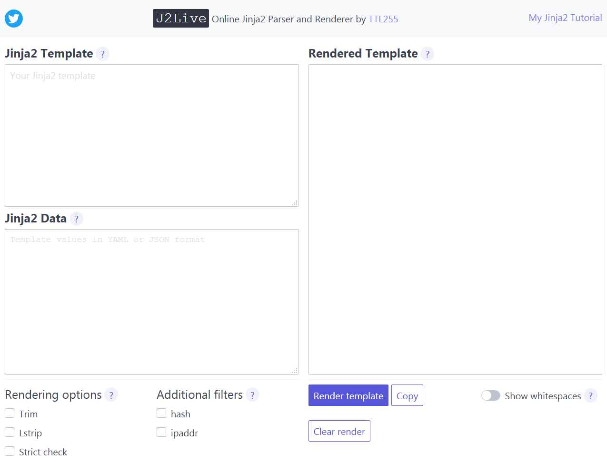

The above screenshot shows the main, and only page, of J2Live, accessible at [https://j2live.ttl255.com](https://j2live.ttl255.com) .

## J2Live Components

The main 3 components are the text windows where you enter your template and data, and one frame where rendered template is displayed.

Jinja2 Template

Here's where you drop body of your template. You can either type in your template directly or you can copy paste the text of existing template.

Jinja2 Data

In the data window you provide values to be passed to your template. These will become dictionary keys that can be then accessed from within the template.

Both JSON and YAML formats are natively supported so you can use either, the correct format will be automatically detected.

Rendered Template

Results of the template render will be shown in this frame.

## Action Buttons

Moving on we have tree action buttons:

- `Render template` - Requests rendering of the template.
- `Copy` - Copies text of rendered template to clipboard.
- `Clear render` - Clears the text of rendered template.

You don't need to use clear render button if you want to render a new template. If you request rendering with `Render template` the new result will just ovewrite the old one.

## Additional Components

Finally there are additional components that provide rendering options, extend template operations and affect displaying of rendered template.

Rendering Options
- `Trim` - removes newlines, which are added by default, after Jinja2 tags.
- `Lstrip` - strips whitespaces before Jinja2 block if any are present.
- `Strict check` - references to undefined variables will result in error.
Additional Filters

I've added two extra filters that you can use in your templates.

- `ipaddr` - this is a copy of `ipaddr` filter found in Ansible and it has the same functionality
- `hash` - generates hash of value it's applied to, takes hashing algorithm as an argument e.g. `hash('sha1')` will use `sha1` algorithm. For list of supported algorithms see link in [References](#references).
Show Whitespaces

Finally, `Show whitespaces` switch enables/disables rendering of non-printable characters like spaces, tabs and newlines.

This option is particularly helpful when you try to learn how Jinja2 adds whitespaces to rendered templates. I spent hours early on in my journey with Jinja2 trying to understand how this works, hopefully with the help of this option you will save yourself some time :)

## Jinja2 Tutorial

You can use **J2Live** as a companion tool for my Jinja2 Tutorial, simply copy paste example templates and data from the blog post.

## J2Live In Action

I've also prepared gifs showing two features in action:

Here we have template rendered without any options and then same template rendered with `Trim` enabled:

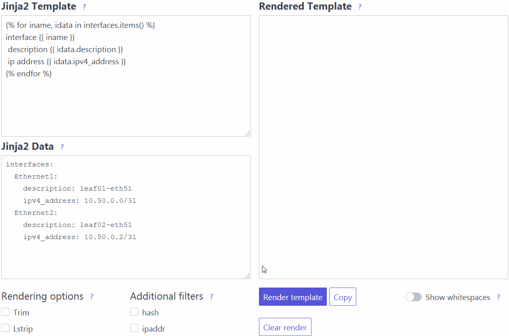

This one is my favourite, you can see here how `Show whitespaces` toggle clearly displays spaces, tabs and newlines in your rendered template:

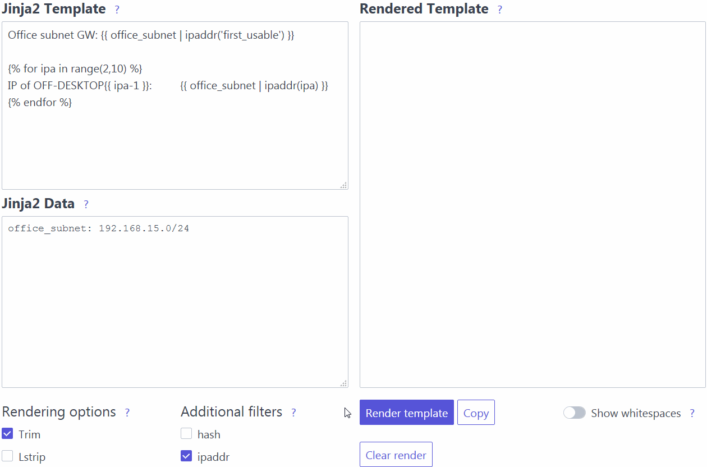

## Closing Thoughts

While app is completely functional I plan to add some more things to it over time. Notably I want to provide all of the examples from my Jinja2 Tutorial as loadable units so that you can immediately try them out.

I also want to open source code of this app so that you can run it locally or go wild with adding filters customized to your use cases. Before I do that I need to tidy up a few things and provide documentation, hopefully it will be all ready within next few weeks.

If you have any questions or encounter any bugs feel free to ping me on Twitter [@ttl255](https://twitter.com/ttl255), I'll try to do my best to help.

I hope you'll find this little tool useful, so make sure to give [J2Live](https://j2live.ttl255.com) a try!

## References

Jinja2 documentation explaining `trim` and `lstrip` options: [https://jinja.palletsprojects.com/en/2.11.x/templates/#whitespace-control](https://jinja.palletsprojects.com/en/2.11.x/templates/#whitespace-control)

Jinja2 documentation describing Undefined types and their behaviour: [https://jinja.palletsprojects.com/en/2.11.x/api/#undefined-types](https://jinja.palletsprojects.com/en/2.11.x/api/#undefined-types)

Python hashlib module docs, lists available hashing algorithms: [https://docs.python.org/3.8/library/hashlib.html#module-hashlib](https://docs.python.org/3.8/library/hashlib.html#module-hashlib)

Official documentation for the latest version of Jinja2 (2.11.x). Available at: [https://jinja.palletsprojects.com/en/2.11.x/](https://jinja.palletsprojects.com/en/2.11.x/)

Jinja2 Python library at PyPi. Available at: [https://pypi.org/project/Jinja2/](https://pypi.org/project/Jinja2/)

GitHub repo with source code for Jinja. Available at: [https://github.com/pallets/jinja/](https://github.com/pallets/jinja/)

GitHub repo with resources for this post. Available at: [https://github.com/progala/ttl255.com/tree/master/jinja2/jinja-tutorial-p1-intro-substitution](https://github.com/progala/ttl255.com/tree/master/jinja2/jinja-tutorial-p1-intro-substitution)

Jinja2 built-in tests. Available at: [https://jinja.palletsprojects.com/en/2.11.x/templates/#list-of-builtin-tests](https://jinja.palletsprojects.com/en/2.11.x/templates/#list-of-builtin-tests)

GitHub repo with resources for this post. Available at: [https://github.com/progala/ttl255.com/tree/master/jinja2/jinja-tutorial-p2-loops-conditionals](https://github.com/progala/ttl255.com/tree/master/jinja2/jinja-tutorial-p2-loops-conditionals)

Documentation for Ansible template module: [https://docs.ansible.com/ansible/latest/modules/template_module.html](https://docs.ansible.com/ansible/latest/modules/template_module.html)

GitHub repo with resources for this post. Available at: [https://github.com/progala/ttl255.com/tree/master/jinja2/jinja-tutorial-p3-whitespace-control](https://github.com/progala/ttl255.com/tree/master/jinja2/jinja-tutorial-p3-whitespace-control)

Jinja2 built-in filters, official docs: [https://jinja.palletsprojects.com/en/2.11.x/templates/#builtin-filters](https://jinja.palletsprojects.com/en/2.11.x/templates/#builtin-filters)

Jinja2 custom filters, official docs: [https://jinja.palletsprojects.com/en/2.11.x/api/#custom-filters](https://jinja.palletsprojects.com/en/2.11.x/api/#custom-filters)

All filters available in Ansible, official docs: [https://docs.ansible.com/ansible/latest/user_guide/playbooks_filters.html](https://docs.ansible.com/ansible/latest/user_guide/playbooks_filters.html)

All filters available in Salt, official docs: [https://docs.saltstack.com/en/latest/topics/jinja/index.html#filters](https://docs.saltstack.com/en/latest/topics/jinja/index.html#filters)

GitHub repo with resources for this post. Available at: [https://github.com/progala/ttl255.com/tree/master/jinja2/jinja-tutorial-p4-template-filters](https://github.com/progala/ttl255.com/tree/master/jinja2/jinja-tutorial-p4-template-filters)

Jinja2 macros, official docs: [https://jinja.palletsprojects.com/en/2.11.x/templates/#macros](https://jinja.palletsprojects.com/en/2.11.x/templates/#macros)

Jinja2 calls, official docs: [https://jinja.palletsprojects.com/en/2.11.x/templates/#call](https://jinja.palletsprojects.com/en/2.11.x/templates/#call)

GitHub repo with resources for this post. Available at: [https://github.com/progala/ttl255.com/tree/master/jinja2/jinja-tutorial-p5-macros](https://github.com/progala/ttl255.com/tree/master/jinja2/jinja-tutorial-p5-macros)

Jinja2 import, official docs: [https://jinja.palletsprojects.com/en/2.11.x/templates/#import](https://jinja.palletsprojects.com/en/2.11.x/templates/#import)

Jinja2 include, official docs: [https://jinja.palletsprojects.com/en/2.11.x/templates/#include](https://jinja.palletsprojects.com/en/2.11.x/templates/#include)

GitHub repo with resources for this post. Available at: [https://github.com/progala/ttl255.com/tree/master/jinja2/jinja-tutorial-p6-import-include](https://github.com/progala/ttl255.com/tree/master/jinja2/jinja-tutorial-p6-import-include)

> [TTL255 - Przemek Rogala's Blog](https://ttl255.com/jinja2-tutorial-part-1-introduction-and-variable-substitution/)
